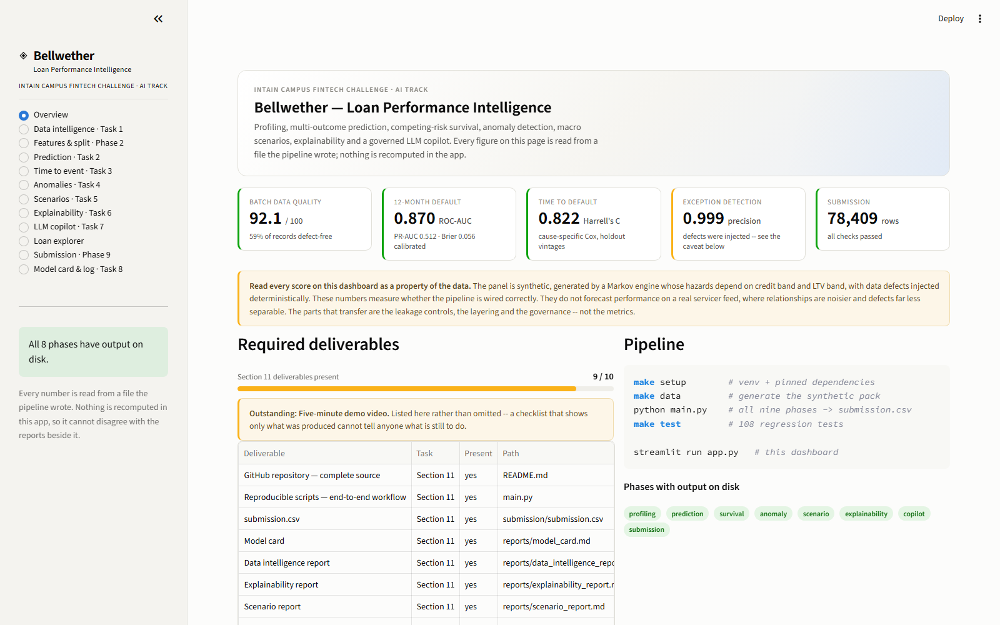
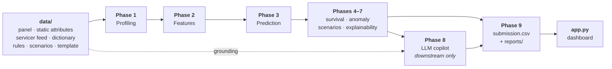

# Bellwether — Loan Performance Intelligence Engine

**Intain Campus FinTech Challenge 2026 · AI Track**

An ML-first system that profiles messy loan-level data, predicts loan performance, detects
anomalies, runs macro scenarios, explains itself, and puts a governed LLM copilot in front
of a human reviewer.

**The predictive work is done by non-LLM models.** The LLM is confined to explaining,
summarising, and drafting reviewer notes from grounded context — it never produces a
prediction. That is the challenge's qualification rule, and the architecture enforces it
rather than promising it.



---

## Documentation

| Guide | What's in it |
| :--- | :--- |
| **[Setup & running](docs/setup.md)** | Install and run on macOS, Linux and Windows · every entry point · troubleshooting |
| **[Architecture](docs/architecture.md)** | How the phases fit together, as diagrams · the module map · phase status |
| **[The pipeline](docs/pipeline.md)** | What each phase writes · every script and its options · the dependency order |
| **[Module reference](docs/api.md)** | Every package in `src/` and what each file is responsible for |
| **[The data pack](docs/data.md)** | The input files, the target columns, the injected defect classes |
| **[Outputs & deliverables](docs/outputs.md)** | `reports/`, `models/`, `submission/`, the AI Development Log |
| **[The dashboard](docs/dashboard.md)** | The twelve pages, with screenshots · what is actually interactive |
| **[Results](docs/results.md)** | Tasks 2–7 measured, with the caveats that change how to read them |
| **[Design decisions](docs/design-decisions.md)** | Why it is built this way, including what was rejected |
| **[Testing](docs/testing.md)** | The regression suite and the guarantees it pins |

---

## Quickstart

Python **3.11+**. Full per-OS instructions in **[docs/setup.md](docs/setup.md)**.

```bash
# macOS / Linux
python3 -m venv .venv && source .venv/bin/activate
pip install -r requirements.txt
python main.py                    # every phase -> submission/submission.csv  (~9 min)
streamlit run app.py              # the dashboard
```

```powershell
# Windows (PowerShell)
python -m venv .venv; .\.venv\Scripts\Activate.ps1
pip install -r requirements.txt
python main.py
streamlit run app.py
```

The data pack is committed, so a fresh clone runs immediately. LightGBM needs an OpenMP
runtime on macOS (`brew install libomp`) and Linux (`apt-get install libgomp1`); the
Windows wheels ship it. See [troubleshooting](docs/setup.md#troubleshooting) if anything
fails.

---

## What this is

Given a book of mortgages reported monthly, three questions matter: **which loans are
likely to deteriorate**, **which records cannot be trusted**, and **what the portfolio
looks like under a worse economy**. This repository answers all three and shows its
working.

- A **268,125-row monthly panel** across 10,000 loans, synthetic and generated here, with
  data defects deliberately injected so detection can be scored against ground truth.
- **Five supervised models** — 3- and 6-month delinquency, 12-month default, 12-month
  prepayment, next state — on a purged, time-aware split, isotonic-calibrated.
- A **cause-specific Cox competing-risk model** for time-to-default and time-to-prepayment.
- A **hybrid anomaly layer** — deterministic rules, sequence-aware detectors and an
  Isolation Forest, combined as a noisy-OR.
- **Macro scenarios**, SHAP explainability, a disparity screen, and a **guarded LLM
  copilot** with a mandatory audit trail.
- A **Streamlit dashboard** whose twelve pages follow the demo flow in order.

**Two things to know before reading any number here.** The data is *synthetic*, so every
metric measures whether the pipeline is wired correctly — not how it would perform on a
real servicer feed. And the anomaly scores look near-perfect because the defects were
injected with near-deterministic fingerprints. Both caveats sit next to the numbers
throughout, not in a footnote.

---

## How it fits together



The full diagram — every artifact and every arrow — is in
**[docs/architecture.md](docs/architecture.md)**.

**The one rule that shapes everything:** the LLM sits strictly *downstream*. Phase 8
consumes Phase 3's probabilities and Phase 5's anomaly scores as inputs and restates them.
No arrow runs from the copilot back into a prediction.

---

## Headline results

Held-out window `2023-01 .. 2023-12`, strictly later than anything the models saw.
Full tables and the caveats in **[docs/results.md](docs/results.md)**.

| Task | Result |
| :--- | :--- |
| **Task 2** — 12-month default | ROC-AUC **0.870** · PR-AUC 0.512 · Brier 0.145 → **0.056** calibrated |
| **Task 3** — time to default | Cox **C = 0.822** vs constant-hazard 0.500; IBS 0.044 vs 0.065 |
| **Task 4** — exception detection | Rules alone 52% recall → **+ sequence detectors 99.7%** → supervised head 99.9% precision |
| **Task 5** — adverse-credit @ 48m | Default 14.1% → **29.3%**; credit channel saturates, and the report says so |
| **Task 6** — calibration | Expected calibration error **0.004 – 0.013** across the three heads |
| **Task 7** — copilot | **93 live calls logged**; the model passed all 6 adversarial probes |

**Reported as-is, not tuned until it looked better:** the **prepayment head does not
work** — ROC-AUC 0.52 against a 0.09 base rate. Three phases reach that conclusion
independently. The generator's prepayment hazard depends only on credit band, so the
signal is not there to find.

---

## Repository layout

| Path | What lives there | Docs |
| :--- | :--- | :--- |
| `src/` | All library code: pipeline packages, dashboard, generator | [Module reference](docs/api.md) |
| `scripts/` | One entry point per phase, plus the data generator | [Pipeline](docs/pipeline.md) |
| `data/` | The input pack the pipeline reads | [Data](docs/data.md) |
| `reports/` | Every graded deliverable, regenerated each run | [Outputs](docs/outputs.md) |
| `models/` | Fitted models and their manifest *(generated)* | [Outputs](docs/outputs.md) |
| `submission/` | The graded `submission.csv` | [Outputs](docs/outputs.md) |
| `tests/` | The regression suite | [Testing](docs/testing.md) |
| `ai_dev_log/` | The AI Development Log (Task 8) | [Outputs](docs/outputs.md#ai_dev_log--the-ai-development-log) |
| `docs/` | This documentation, plus dashboard screenshots | — |

| Root file | Purpose |
| :--- | :--- |
| `main.py` | The single entry point: every phase, ending in `submission.csv` |
| `app.py` | The Streamlit dashboard |
| `Makefile` | Shortcuts for each phase (macOS / Linux) |
| `requirements.txt` | Pinned dependencies, each with the version it was verified against |
| `.env.example` | Template for the copilot's API key; copy to `.env` |
| `.streamlit/config.toml` | Pins the app's theme and enables static report serving |
| `.github/workflows/ci.yml` | Tests plus a small-sample smoke run of every pipeline |

---

## Required deliverables

| Deliverable | Where |
| :--- | :--- |
| GitHub repository | this repo |
| Reproducible scripts | [`main.py`](main.py) · [docs/pipeline.md](docs/pipeline.md) |
| `submission.csv` | [`submission/submission.csv`](submission/) |
| Model card | [`reports/model_card.md`](reports/model_card.md) |
| Data intelligence report | [`reports/data_intelligence_report.md`](reports/data_intelligence_report.md) |
| Explainability report | [`reports/explainability_report.md`](reports/explainability_report.md) |
| Scenario report | [`reports/scenario_report.md`](reports/scenario_report.md) |
| LLM copilot demo | [`reports/copilot_report.md`](reports/copilot_report.md) · [audit trail](reports/llm_prompt_log.jsonl) |
| AI Development Log | [`ai_dev_log/log.md`](ai_dev_log/log.md) |
| Five-minute demo video | **outstanding** — the one deliverable not yet produced |

The dashboard's Overview page resolves this checklist against the filesystem at run time,
so it reports what is actually present rather than what was intended.
