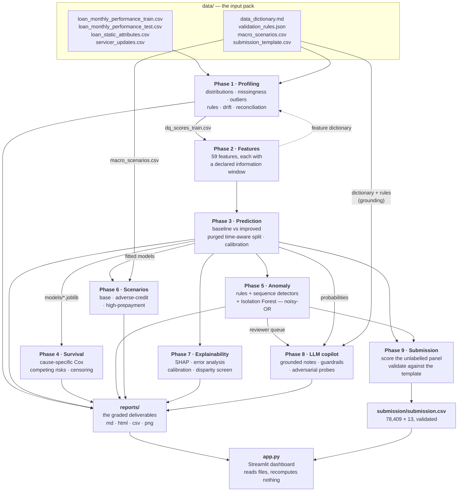
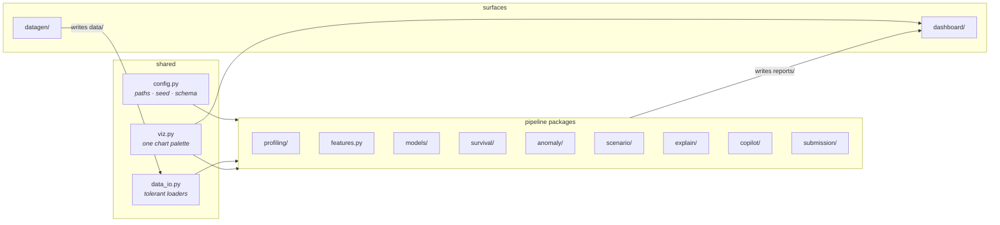

# Architecture

> **Docs:** [Setup](setup.md) · [Architecture](architecture.md) · [Pipeline](pipeline.md) · [Module reference](api.md) · [Data](data.md) · [Outputs](outputs.md) · [Dashboard](dashboard.md) · [Results](results.md) · [Design decisions](design-decisions.md) · [Testing](testing.md)
>
> [← Back to the README](../README.md)

---

Nine phases, run in the order that resolves their one circular dependency: profiling
produces the record-level data-quality score the feature matrix consumes, and the
prediction run emits the feature dictionary the Data Intelligence Report folds in — so
profiling runs at both ends.

**The one rule that shapes everything above:** the LLM sits strictly *downstream*. Phase 8
consumes Phase 3's probabilities and Phase 5's anomaly scores as inputs and restates them.
No arrow runs from Phase 8 back into a prediction.

### Module map

Each package has its responsibilities documented in **[the module reference](api.md)**.

---

## Phase status

| Phase | Task | Points | Status |
| :--- | :--- | ---: | :--- |
| 0 — Repo & environment | — | 5 (ML Eng) | Done (`make all`, CI) |
| 1 — Data intelligence & profiling | Task 1 | 15 | Done (+ figures) |
| 2 — Feature engineering | — | (feeds Task 2) | Done (+ dictionary) |
| 3 — Loan performance prediction | Task 2 | 20 | Done |
| 4 — Survival / transition modeling | Task 3 | 15 | Done |
| 5 — Anomaly & exception detection | Task 4 | 10 | Done |
| 6 — Scenario & stress simulation | Task 5 | 10 | Done |
| 7 — Explainability | Task 6 | 10 | Done |
| 8 — LLM reviewer copilot | Task 7 | 10 | Done |
| 9 — Packaging & submission | — | — | Done |
| 10 — AI development log | Task 8 | 5 | Ongoing |

---

