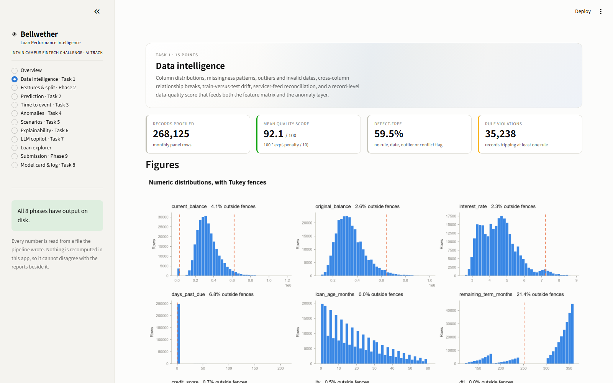
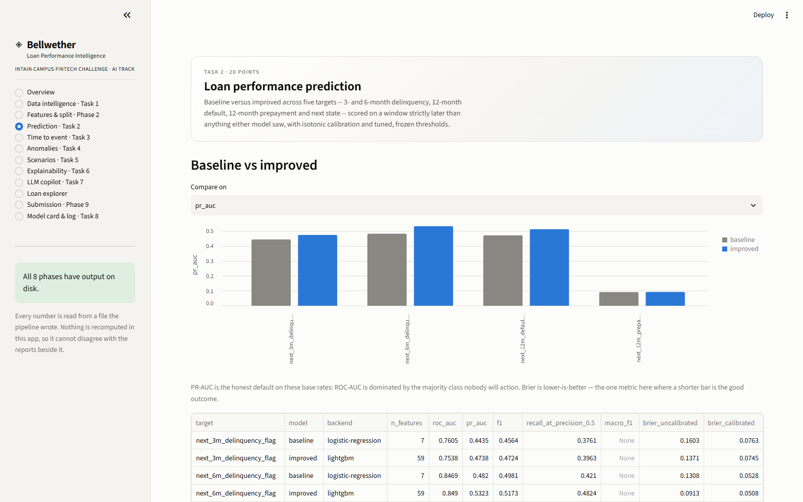
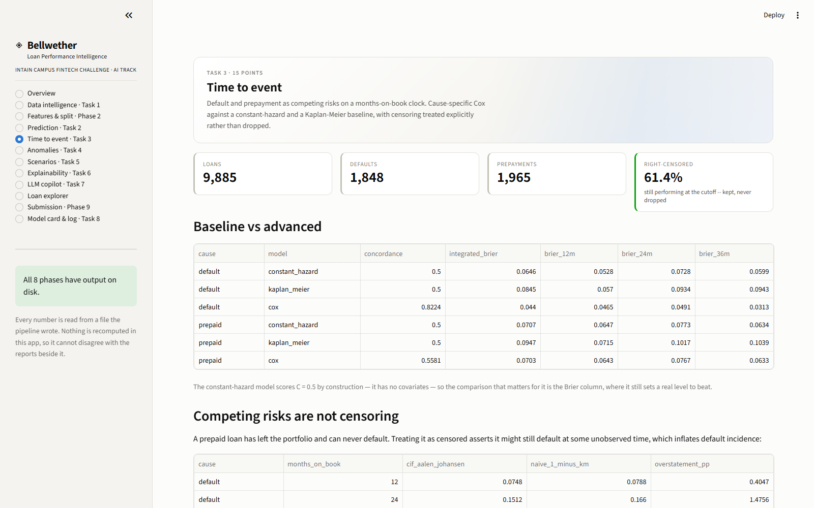
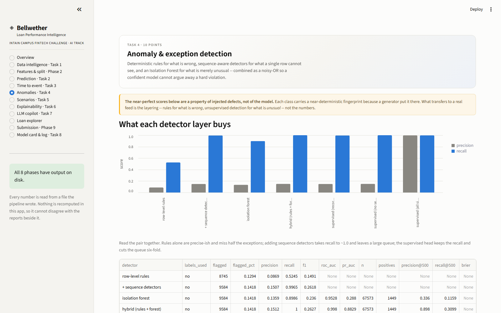
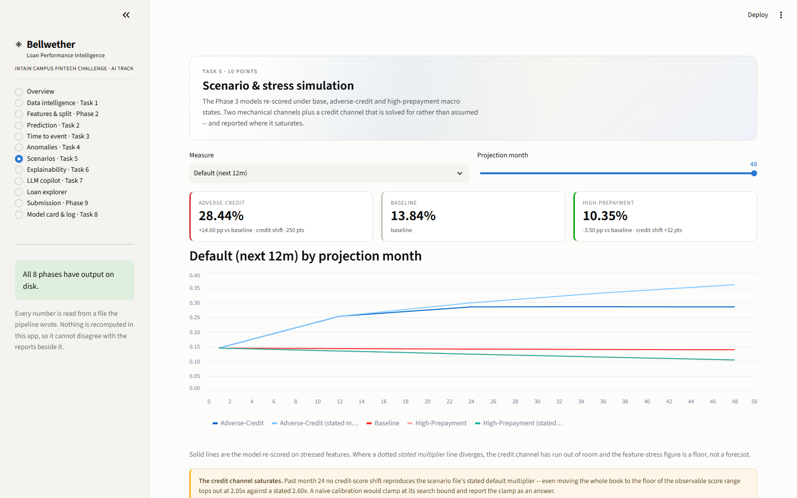
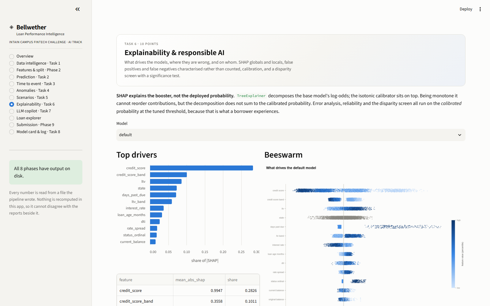
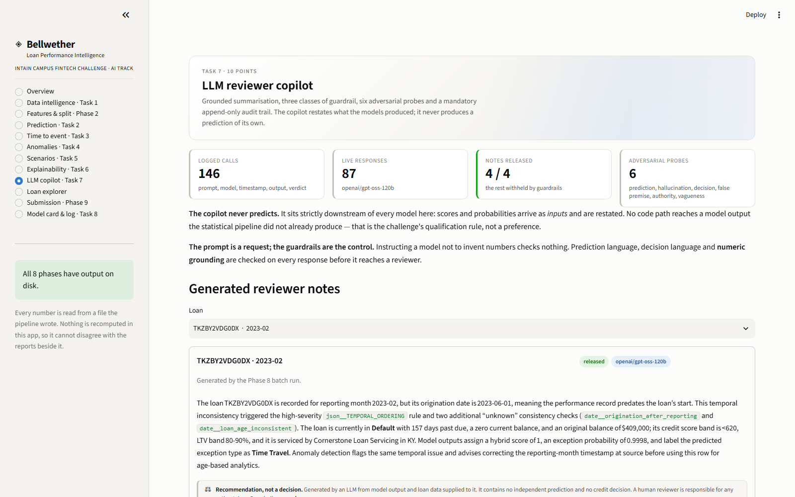
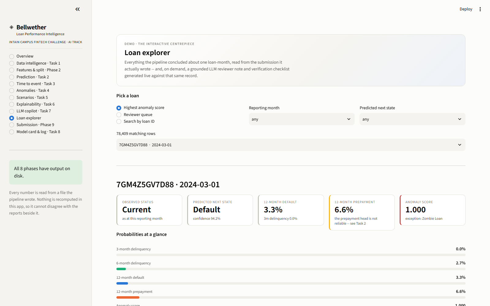
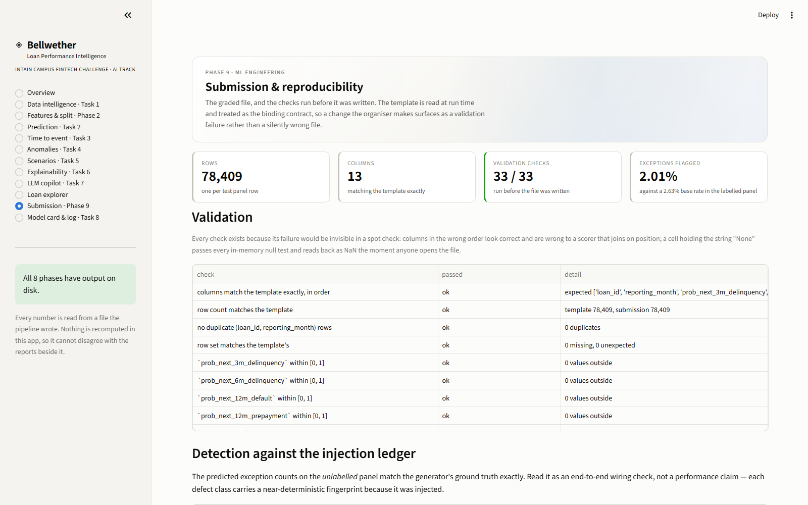
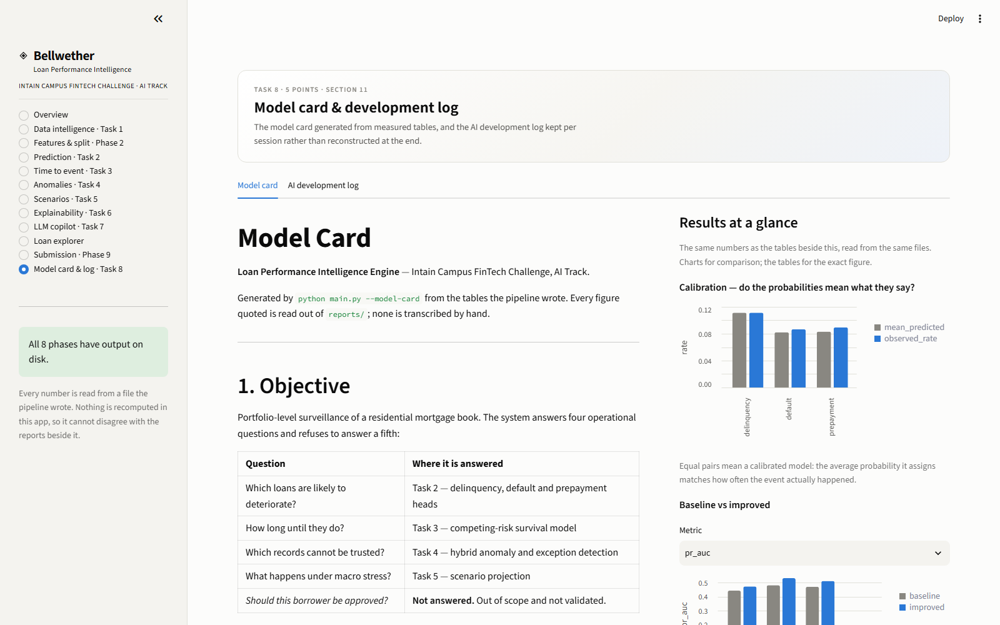

# The dashboard

> **Docs:** [Setup](setup.md) · [Architecture](architecture.md) · [Pipeline](pipeline.md) · [Module reference](api.md) · [Data](data.md) · [Outputs](outputs.md) · [Dashboard](dashboard.md) · [Results](results.md) · [Design decisions](design-decisions.md) · [Testing](testing.md)
>
> [← Back to the README](../README.md)

---

**Demo video: [five-minute walkthrough](https://www.loom.com/share/81cca5f0ad69456fb7ccead173950bc1)** · **Live app: [fintech-cqm5kbt2xwkx3krp7gacjb.streamlit.app](https://fintech-cqm5kbt2xwkx3krp7gacjb.streamlit.app)** — no setup required; it serves the
committed pipeline outputs.

```bash
streamlit run app.py
```

The dashboard ships as **Bellwether** — the sheep that leads the flock, and in markets the
indicator that moves first, which is what a loan-performance engine is for. The name is
deliberately none of the servicer names the generator invents (Atlas, Northgate,
Cornerstone, Beacon, Meridian), so a name on the page can never be mistaken for a name in
the data. It is set in one place, `src/dashboard/theme.PRODUCT_NAME`.

Twelve pages, **ordered to match the demo flow in section 14** — dataset and targets,
profiling, features and the time-aware split, baseline then improved model, survival output,
anomaly examples, scenario output, a local explanation, an LLM note and a rejected one, the
submission, and the development log. It can be walked top to bottom on camera without
deciding what comes next.

**Nothing is recomputed in the app.** Every number is read from a file the pipeline wrote.
A dashboard that recalculates its own figures can disagree with the report beside it, and
the version a viewer trusts is whichever they saw last. A phase that has not run shows the
command to run, not an empty panel.

**Every generated HTML report is reachable three ways** from the page it belongs to:
**Open as a page** (its own URL, in a new tab), **Read inline** (without leaving the app),
or **Download**. This is served rather than linked, because it cannot be linked: Streamlit
serves the app from its own origin and never exposes the working directory over HTTP, so a
relative `<a href>` resolves to nothing and a `file://` link is blocked outright by the
browser. Each report is republished as a **self-contained** document — figures inlined as
data URIs — into Streamlit's served `static/` directory, so the standalone page still works
when it is bookmarked or forwarded.

**What is actually interactive**, rather than a report with tabs:

- **Loan explorer** — pick any of the 78,409 scored rows by anomaly rank, reviewer queue
  membership or ID search, filtered by month and predicted state. Shows the observed status,
  all four probabilities on a common scale, the anomaly score, drivers, recommended action
  and the LLM reviewer note where one exists.
- **Analyse with AI** — generates a grounded reviewer note for the selected loan *live*,
  against the loan's own record, the data-dictionary definitions of its fields, the rules
  that fired and the models' own outputs. **Recommend action** asks a second question of
  that same context: the concrete verification steps a reviewer should take. Both run the
  full guardrail stack and both append to `reports/llm_prompt_log.jsonl` — an interactive
  call that skipped either would be a governance hole opened for the sake of a demo button.
  The withheld case is rendered in full, with the failure stated, exactly as the batch
  pipeline does.

  "Recommend action" asks what to **verify**, never what to decide. The deterministic rule
  layer is what emits a suggested action; what the model adds is the checklist for
  confirming or refuting it. Phrasing it that way is what keeps the button on the correct
  side of the decision guardrail instead of quietly defeating it.
- **Scenarios** — choose a measure and a projection month; the tiles and the chart update,
  with the stated-multiplier line overlaid where the credit channel saturates.
- **Anomalies** — filter the reviewer queue by predicted type and a hybrid-score floor.
- **Explainability** — switch model, then step through the four local waterfall cases.
- **Copilot** — inspect any adversarial probe: the trap, the model's actual response, the
  guardrail verdict and the human correction.

The page uses the **same validated palette as the figures** it embeds, and a test asserts
that — a page in a different colour language than the charts inside it reads as two products
stapled together.

A dedicated set of tests renders every page through Streamlit's own harness. Nothing else in the suite
imports these modules, so without them the app could break silently on a Streamlit upgrade
and nobody would find out until the demo.

---


---

## A tour of the interface

Twelve pages, ordered to match the demo flow in section 14 of the problem statement, so
the app can be walked top to bottom on camera without deciding what comes next.

### Data intelligence — Task 1

Profiling, missingness, outliers, drift and the record-level quality score. Every report
can be opened as its own page, read inline, or downloaded.



### Prediction — Task 2

Baseline versus improved across five targets, with the metric selectable. The caveats sit
beside the numbers rather than under them.



### Time to event — Task 3

Competing-risk survival on a months-on-book clock, against two baselines.



### Anomalies — Task 4

What each detector layer buys, and the curated reviewer queue with live filters.



### Scenarios — Task 5

Base, adverse-credit and high-prepayment projections, with the measure and horizon
interactive and the saturation of the credit channel drawn rather than described.



### Explainability — Task 6

SHAP globals and locals, error analysis, calibration and the disparity screen.



### LLM copilot — Task 7

Grounded notes, six adversarial probes, the guardrail failures, and the audit trail.



### Loan explorer

The interactive centrepiece: any of the 78,409 scored rows, with **Analyse with AI** and
**Recommend action** generating grounded output live against that same record.



### Submission — Phase 9

The graded file and every check run before it was written.



### Model card & development log — Task 8

The documents, with charts of the same numbers beside them.



Screenshots are regenerated with `python scripts/capture_screenshots.py --launch`
(requires `pip install playwright && playwright install chromium`).

---


---

Images used by the root [README](../README.md). No prose lives here; the documentation
itself is the README in each folder, next to the code it describes.

```
docs/
└── screenshots/     dashboard captures embedded in the root README
```

---

## Regenerating the screenshots

Screenshots in a README rot faster than any other documentation: the UI moves, nobody
re-shoots, and the page ends up advertising a product that no longer exists. Keeping the
capture as a script means regenerating them is one command rather than eleven manual
window-drags, so it actually gets done.

```bash
pip install playwright && playwright install chromium   # one-time, optional extra
python scripts/capture_screenshots.py --launch
```

`--launch` starts Streamlit, captures, and stops it again. If the app is already running,
drop the flag and pass `--url http://localhost:8501`.

Two settings in
[`scripts/capture_screenshots.py`](pipeline.md#the-supporting-scripts) are
deliberate:

- **`color_scheme="light"`** — pinned to match `.streamlit/config.toml`. Left to the
  machine's own preference, the shots would come out in whichever theme the capturing
  laptop happened to be in.
- **`device_scale_factor=1`** — a 2× capture of this UI is four times the bytes for detail
  nobody reads at README width. Eleven retina PNGs is most of a ten-megabyte clone.

**Playwright is not in `requirements.txt`** on purpose: a judge reproducing the pipeline
should not have to download a browser engine to do it.
