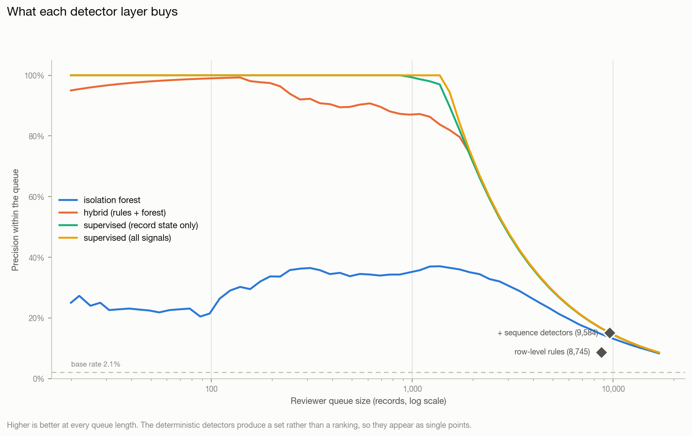
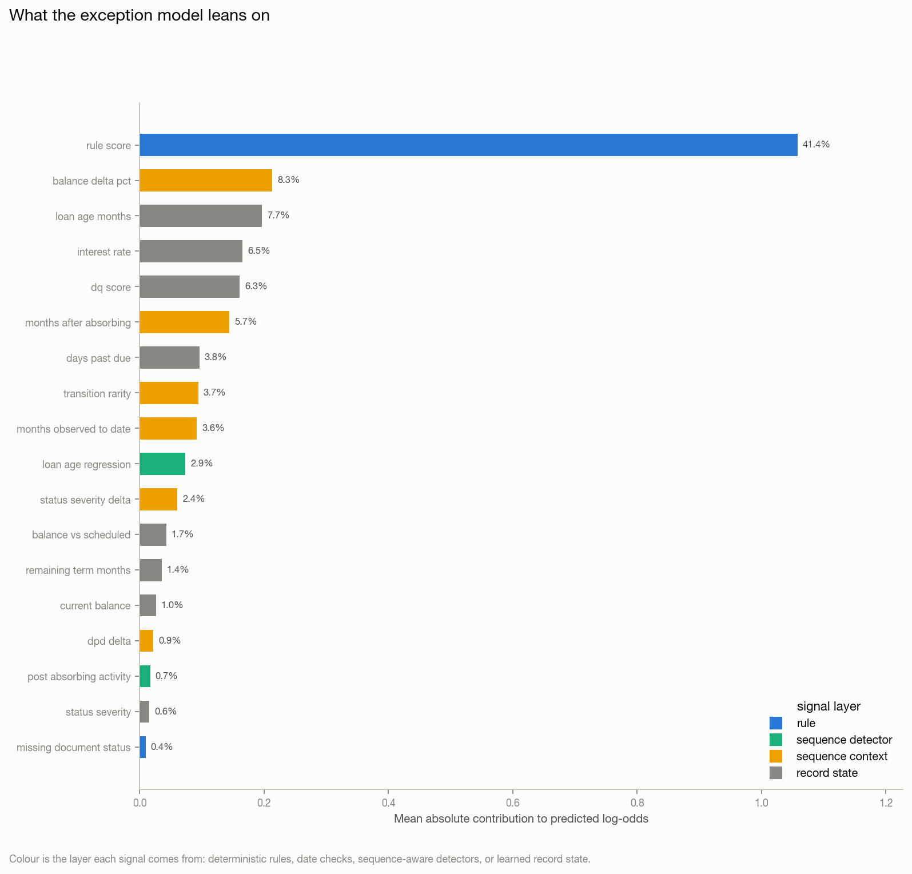

# Anomaly & Exception Report (Task 4)

_Generated 2026-08-29 23:52:53_

## What this detects

Record-level data defects in the monthly performance panel: a continuous anomaly score for every row, a predicted probability and type for the `exception_required` / `exception_type` labels, the drivers behind each flag, and a curated queue a reviewer can work without opening the pipeline.

Fitted on `2017-01 .. 2021-06` (108,125 records), tuned on `2021-07 .. 2022-12` (92,427) and reported on `2023-01 .. 2023-12` (67,573), which no detector was fitted or thresholded on.

## How to read these numbers

**Read the near-perfect scores below as a property of the data, not of the model.**
The supervised head reaches 0.999 precision at 0.999 recall and a perfect
per-class F1 on all five exception types. That is not a modelling achievement;
it is what happens when every defect class carries a near-deterministic
fingerprint:

| defect class | fingerprint | separability |
| :--- | :--- | :--- |
| Balance Discrepancy | balance above origination | caught exactly by two row-level rules |
| Time Travel | reporting month before origination | caught exactly by the date checks |
| Zombie Loan | active row after a terminal row | caught exactly by a sequence detector |
| Impossible State Transition | delinquency bucket skipped | caught by a sequence detector |

Each was *injected* by a generator, and an injection leaves a cleaner trace
than a real servicing error does. Real defects arrive partially, inconsistently
and mixed with legitimate rarities. **The numbers here measure whether the
pipeline is wired correctly; they do not forecast performance on a real
servicer feed.** The parts that would transfer are the layering, the
noisy-OR combination, the sequence detectors and the curation -- not the scores.

The ablation table is included precisely so this is checkable rather than
asserted: it shows how much of the result each layer is responsible for.

## Detector comparison

Each detector measured on the held-out window. `flagged` is the size of the reviewer queue it implies; `precision@k` is what fraction of the first k records are real exceptions.

| detector                       | labels_used   |   flagged |   flagged_pct |   precision |   recall |       f1 |    roc_auc |     pr_auc |     n |   positives |   precision@500 |   recall@500 |         brier |
|:-------------------------------|:--------------|----------:|--------------:|------------:|---------:|---------:|-----------:|-----------:|------:|------------:|----------------:|-------------:|--------------:|
| row-level rules                | no            |      8745 |     0.129416  |   0.0869068 | 0.5245   | 0.149107 | nan        | nan        |   nan |         nan |         nan     |   nan        | nan           |
| + sequence detectors           | no            |      9584 |     0.141832  |   0.150668  | 0.996549 | 0.26176  | nan        | nan        |   nan |         nan |         nan     |   nan        | nan           |
| isolation forest               | no            |      9584 |     0.141832  |   0.135851  | 0.898551 | 0.236019 |   0.952753 |   0.287969 | 67573 |        1449 |           0.338 |     0.116632 | nan           |
| hybrid (rules + forest)        | no            |      9584 |     0.141832  |   0.151189  | 1        | 0.262667 |   0.997984 |   0.882887 | 67573 |        1449 |           0.898 |     0.309869 | nan           |
| supervised (record state only) | yes           |      9584 |     0.141832  |   0.150563  | 0.995859 | 0.261579 |   0.99815  |   0.978632 | 67573 |        1449 |           1     |     0.345066 | nan           |
| supervised (no sequence flags) | yes           |      9584 |     0.141832  |   0.151189  | 1        | 0.262667 |   1        |   1        | 67573 |        1449 |           1     |     0.345066 | nan           |
| supervised (all signals)       | yes           |      1450 |     0.0214583 |   0.998621  | 0.99931  | 0.998965 |   1        |   0.999998 | 67573 |        1449 |           1     |     0.345066 |   2.86179e-05 |

## How the hybrid is built

**The two layers do different jobs, and the split is measurable.**

Row-level rules -- the organiser's `validation_rules.json` plus this project's
own domain checks -- decide from a single record. They catch every Balance
Discrepancy and every Time Travel defect in this pack, and roughly one in ten
Impossible State Transitions and Zombie Loans. That is not a tuning failure: an
expression evaluated against one row cannot see last month's status, and cannot
know the loan was already terminal.

**Sequence-aware detectors** close that gap. `post_absorbing_activity` and
`illegal_status_transition` take recall on the two invisible classes from 12%
and 9% to 100% and 99%, lifting overall recall from 52% to 99.7%. They are
still deterministic -- they are rules, just rules that need the loan's history
-- so they are reported as part of the deterministic layer, not as an ML
result.

**What is left for the model is precision.** With the sequence detectors in
place the deterministic layer reaches 99.7% recall at 15.1% precision: a queue
of 9,584 records to find 1,449 exceptions, most of the excess coming from one
low-severity rule that fires on 11.8% of the book. The supervised head cuts
that queue to 1,450 records at 99.9% precision -- the same exceptions, a
sixth of the reviewing.

**The learned layer did find something the rules did not.** The ablation row
*supervised (record state only)* sees no sequence detector flags and no
month-on-month context, yet still reaches 0.979 PR-AUC. Its dominant feature is
`balance_vs_scheduled`, the ratio of reported balance to the amortisation
schedule, and inspecting it explains why:

* **Zombie Loan** rows carry a stale balance -- mean ratio 0.77 against 0.99
  for clean records, with 85% deviating more than 10% from schedule.
* **Impossible State Transition** rows sit at *exactly* 1.000 while genuine
  90-DPD records sit at 1.005 or above, because a real three-months-delinquent
  loan has accrued arrears and the injected row was written with a performing
  loan's balance.

Neither fingerprint was anticipated by any hand-written rule. This is the
honest case for the learned layer: not that it beat the rules on the headline
metric, but that it located a row-level signature of two defects that the rule
author believed were only visible in sequence.

**The unsupervised layer's unsupported flags are benign -- and that is the
finding.** Every one of the five highest-scoring records with no rule violation
is an ordinary loan termination: `Default` or `Prepaid` with a zero balance,
which is statistically extreme and operationally correct. An Isolation Forest
run alone on this book would put clean terminations at the top of the reviewer
queue. That is the concrete case for the hybrid: unsupervised novelty detection
finds what is *unusual*, and only the rule layer knows what is *wrong*.

**Scores combine as a noisy-OR, not a weighted average.**
`hybrid = 1 - (1 - rule_score) * (1 - ml_score)`. A fired high-severity rule
sets a floor the model cannot argue down; the model can only add suspicion on
top. A weighted average would let a confident model talk away a hard
violation, which is not a trade a servicer would accept.

**Continuous detectors are cut at a fixed queue size, not a fixed threshold.**
A rank-normalised score has no natural cut point -- a 0.5 threshold on the
Isolation Forest flags half the book. Every row of the ablation is therefore
evaluated at the same queue size the full deterministic layer produces, so the
comparison is at equal reviewer cost.

### Splitting

The exception labels are **contemporaneous**: `exception_required` describes
the record it sits on, not a future outcome. So unlike Task 2 there is no
forward window to purge -- but the split is still strictly by
`reporting_month`, and for the same reason: a random split would put one month
of a loan in training and the next month of the same loan in test, and the
sequence features (`months_after_absorbing`, `status_severity_delta`) are
explicitly built from adjacent months. Absorbing-state rows are **kept**, not
dropped as they are in Tasks 2 and 3 -- a terminal row can itself be the defect.

## Deterministic signal coverage

Every rule, date check and sequence detector: how often it fires and how often it is right. A signal that fires constantly and is almost never an exception is a reviewer's time being spent, so it is named rather than averaged away.

| signal                                      | layer   | severity   |   n_fired |   pct_fired |   precision_vs_exception |
|:--------------------------------------------|:--------|:-----------|----------:|------------:|-------------------------:|
| rule__missing_document_status               | rule    | low        |     31675 |     11.8135 |                   0.0251 |
| seq__balance_increase_without_modification  | seq     | medium     |      4788 |      1.7857 |                   0.6855 |
| seq__illegal_status_transition              | seq     | high       |      2394 |      0.8929 |                   0.9783 |
| rule__json__BALANCE_CEILING                 | rule    | high       |      2316 |      0.8638 |                   1      |
| rule__balance_exceeds_original              | rule    | high       |      2316 |      0.8638 |                   1      |
| rule__json__TEMPORAL_ORDERING               | rule    | high       |      1724 |      0.643  |                   1      |
| date__date__origination_after_reporting     | date    | high       |      1724 |      0.643  |                   1      |
| date__date__loan_age_inconsistent           | date    | high       |      1718 |      0.6407 |                   1      |
| seq__delinquency_bucket_skip                | seq     | medium     |      1703 |      0.6352 |                   0.9841 |
| seq__loan_age_regression                    | seq     | high       |      1601 |      0.5971 |                   0.0518 |
| seq__post_absorbing_activity                | seq     | high       |      1319 |      0.4919 |                   1      |
| rule__closed_status_with_balance            | rule    | high       |         0 |      0      |                 nan      |
| rule__zero_original_balance                 | rule    | high       |         0 |      0      |                 nan      |
| rule__default_and_prepaid_together          | rule    | high       |         0 |      0      |                 nan      |
| date__date__last_update_before_reporting    | date    | high       |         0 |      0      |                 nan      |
| rule__dpd_implausibly_large                 | rule    | medium     |         0 |      0      |                 nan      |
| rule__negative_loan_age                     | rule    | high       |         0 |      0      |                 nan      |
| rule__implausible_interest_rate             | rule    | medium     |         0 |      0      |                 nan      |
| rule__negative_remaining_term               | rule    | high       |         0 |      0      |                 nan      |
| rule__json__LOAN_ID_PRESENT                 | rule    | high       |         0 |      0      |                 nan      |
| rule__current_status_but_high_dpd           | rule    | medium     |         0 |      0      |                 nan      |
| rule__json__REPORTING_MONTH_PRESENT         | rule    | high       |         0 |      0      |                 nan      |
| rule__default_without_delinquency           | rule    | high       |         0 |      0      |                 nan      |
| rule__prepaid_with_positive_balance         | rule    | high       |         0 |      0      |                 nan      |
| rule__negative_balance                      | rule    | high       |         0 |      0      |                 nan      |
| rule__json__DOCUMENT_STATUS_DOMAIN          | rule    | low        |         0 |      0      |                 nan      |
| rule__json__MUTUALLY_EXCLUSIVE_TERMINATION  | rule    | high       |         0 |      0      |                 nan      |
| rule__json__TERM_NON_NEGATIVE               | rule    | medium     |         0 |      0      |                 nan      |
| rule__json__RATE_RANGE                      | rule    | medium     |         0 |      0      |                 nan      |
| rule__json__DEFAULT_DELINQUENCY_CONSISTENCY | rule    | high       |         0 |      0      |                 nan      |
| rule__json__ABSORBING_STATE_FINALITY        | rule    | high       |         0 |      0      |                 nan      |
| rule__json__SEQUENTIAL_DELINQUENCY          | rule    | high       |         0 |      0      |                 nan      |
| rule__json__STATUS_DOMAIN                   | rule    | high       |         0 |      0      |                 nan      |
| rule__json__DPD_RANGE                       | rule    | medium     |         0 |      0      |                 nan      |
| rule__json__BALANCE_SIGN                    | rule    | high       |         0 |      0      |                 nan      |
| rule__delinquent_but_current_status         | rule    | high       |         0 |      0      |                 nan      |

## Exception type classification

Five-way over every record, `None` included. Macro-F1 leads because `None` is 97.4% of the panel and accuracy is maximised by never predicting an exception.

|   macro_f1 |   weighted_f1 |   accuracy |
|-----------:|--------------:|-----------:|
|          1 |             1 |          1 |

### Per-class performance

| exception_type              |   precision |   recall |   f1 |   support |
|:----------------------------|------------:|---------:|-----:|----------:|
| No exception                |           1 |        1 |    1 |     66124 |
| Balance Discrepancy         |           1 |        1 |    1 |       576 |
| Impossible State Transition |           1 |        1 |    1 |       434 |
| Time Travel                 |           1 |        1 |    1 |        90 |
| Zombie Loan                 |           1 |        1 |    1 |       349 |

### Confusion matrix

|                                  |   pred_No exception |   pred_Balance Discrepancy |   pred_Impossible State Transition |   pred_Time Travel |   pred_Zombie Loan |
|:---------------------------------|--------------------:|---------------------------:|-----------------------------------:|-------------------:|-------------------:|
| true_No exception                |               66124 |                          0 |                                  0 |                  0 |                  0 |
| true_Balance Discrepancy         |                   0 |                        576 |                                  0 |                  0 |                  0 |
| true_Impossible State Transition |                   0 |                          0 |                                434 |                  0 |                  0 |
| true_Time Travel                 |                   0 |                          0 |                                  0 |                 90 |                  0 |
| true_Zombie Loan                 |                   0 |                          0 |                                  0 |                  0 |                349 |

## What drives the model

Mean absolute contribution to the predicted log-odds, from the booster's own per-row attributions. The `layer` column shows how much of the model's decision rests on deterministic evidence versus learned pattern.

| feature                        |   mean_abs_contribution |      share | layer             |
|:-------------------------------|------------------------:|-----------:|:------------------|
| rule_score                     |              1.05815    | 0.414118   | rule              |
| balance_delta_pct              |              0.213164   | 0.0834234  | sequence context  |
| loan_age_months                |              0.196578   | 0.0769325  | record state      |
| interest_rate                  |              0.165196   | 0.0646509  | record state      |
| dq_score                       |              0.160868   | 0.062957   | record state      |
| months_after_absorbing         |              0.144502   | 0.0565522  | sequence context  |
| days_past_due                  |              0.0958241  | 0.0375016  | record state      |
| transition_rarity              |              0.0943235  | 0.0369143  | sequence context  |
| months_observed_to_date        |              0.0917411  | 0.0359037  | sequence context  |
| seq__loan_age_regression       |              0.0736291  | 0.0288154  | sequence detector |
| status_severity_delta          |              0.0607521  | 0.0237759  | sequence context  |
| balance_vs_scheduled           |              0.0428133  | 0.0167553  | record state      |
| remaining_term_months          |              0.0351668  | 0.0137628  | record state      |
| current_balance                |              0.0263012  | 0.0102932  | record state      |
| dpd_delta                      |              0.0220789  | 0.00864078 | sequence context  |
| seq__post_absorbing_activity   |              0.016832   | 0.00658734 | sequence detector |
| status_severity                |              0.0152247  | 0.00595831 | record state      |
| rule__missing_document_status  |              0.00959017 | 0.0037532  | rule              |
| document_status                |              0.0091787  | 0.00359216 | record state      |
| seq__illegal_status_transition |              0.00819441 | 0.00320695 | sequence detector |

## Curated reviewer queue

Stratified rather than top-N: a guaranteed block per exception type plus reserved slots for high-scoring records with no rule violation, which are the only rows in the queue that can teach the rule set something. Full file: `reports/anomaly_examples.csv`.

| loan_id      | reporting_month   | current_status   |   current_balance |   hybrid_score |   rule_score |   ml_score |   exception_probability | triggered_rules                                                                                                         | top_drivers                                                                                                   | predicted_exception_type    | suggested_action                                                                                                                                      |
|:-------------|:------------------|:-----------------|------------------:|---------------:|-------------:|-----------:|------------------------:|:------------------------------------------------------------------------------------------------------------------------|:--------------------------------------------------------------------------------------------------------------|:----------------------------|:------------------------------------------------------------------------------------------------------------------------------------------------------|
| TKZBY2VDG0DX | 2023-02           | Default          |       0           |       1        |     0.999    |   0.999982 |             0.999756    | json__TEMPORAL_ORDERING; date__origination_after_reporting; date__loan_age_inconsistent                                 | days past due=157; balance delta pct=missing; loan age regression=0                                           | Time Travel                 | Reporting month precedes origination. Correct the timestamp at source; the row cannot be used for age-based analytics until it is fixed.              |
| NHMLYYAJ40VH | 2023-05           | Current          |       1.05331e+06 |       1        |     0.99575  |   0.999991 |             0.999996    | json__BALANCE_CEILING; balance_exceeds_original; balance_increase_without_modification; missing_document_status         | balance delta pct=0.58; loan age regression=0; loan age months=54                                             | Balance Discrepancy         | Balance exceeds origination with no modification recorded. Request the modification agreement, or treat the balance as a servicing error.             |
| K3MSRHPO8MHK | 2023-12           | Current          |  524929           |       1        |     0.995    |   0.999982 |             0.999989    | post_absorbing_activity; illegal_status_transition; balance_increase_without_modification                               | post absorbing activity=1; transition rarity=0.00125; balance delta pct=missing                               | Zombie Loan                 | Loan already reached a terminal state. Confirm the termination date with the servicer and suppress the later rows; do not re-activate the loan.       |
| SW3CSFZ1HQ5Y | 2023-06           | Current          |  439531           |       1        |     0.995    |   0.999982 |             0.999987    | post_absorbing_activity; illegal_status_transition; balance_increase_without_modification                               | post absorbing activity=1; transition rarity=0.00125; balance delta pct=missing                               | Zombie Loan                 | Loan already reached a terminal state. Confirm the termination date with the servicer and suppress the later rows; do not re-activate the loan.       |
| RK1NEXSOD8VF | 2023-07           | Current          |  877969           |       1        |     0.995    |   0.999982 |             0.999988    | post_absorbing_activity; illegal_status_transition; balance_increase_without_modification                               | post absorbing activity=1; transition rarity=0.00125; balance delta pct=missing                               | Zombie Loan                 | Loan already reached a terminal state. Confirm the termination date with the servicer and suppress the later rows; do not re-activate the loan.       |
| FIMYS4DO8VYD | 2023-03           | Current          |  289513           |       1        |     0.995    |   0.999982 |             0.999988    | post_absorbing_activity; illegal_status_transition; balance_increase_without_modification                               | post absorbing activity=1; transition rarity=0.00125; balance delta pct=missing                               | Zombie Loan                 | Loan already reached a terminal state. Confirm the termination date with the servicer and suppress the later rows; do not re-activate the loan.       |
| XVXZK2HX6I1Z | 2023-06           | 90-DPD           |  327669           |       1        |     0.99575  |   0.999972 |             0.999997    | json__BALANCE_CEILING; balance_exceeds_original; balance_increase_without_modification; missing_document_status         | transition rarity=0.00228; balance delta pct=0.42; loan age regression=0                                      | Balance Discrepancy         | Balance exceeds origination with no modification recorded. Request the modification agreement, or treat the balance as a servicing error.             |
| JUPT8JULM5C4 | 2023-04           | Current          |  164633           |       1        |     0.995    |   0.999972 |             0.999983    | post_absorbing_activity; illegal_status_transition; balance_increase_without_modification                               | post absorbing activity=1; balance delta pct=missing; months after absorbing=1.00                             | Zombie Loan                 | Loan already reached a terminal state. Confirm the termination date with the servicer and suppress the later rows; do not re-activate the loan.       |
| ZBDXOWNX1MV2 | 2023-01           | Current          |  595797           |       1        |     0.995    |   0.999954 |             0.999997    | json__BALANCE_CEILING; balance_exceeds_original; balance_increase_without_modification                                  | balance delta pct=0.61; loan age regression=0; loan age months=57                                             | Balance Discrepancy         | Balance exceeds origination with no modification recorded. Request the modification agreement, or treat the balance as a servicing error.             |
| EXIA6HA0N6QC | 2023-05           | Current          |  642106           |       1        |     0.995    |   0.999954 |             0.999997    | json__BALANCE_CEILING; balance_exceeds_original; balance_increase_without_modification                                  | balance delta pct=0.56; loan age regression=0; loan age months=45                                             | Balance Discrepancy         | Balance exceeds origination with no modification recorded. Request the modification agreement, or treat the balance as a servicing error.             |
| KPUKLAHZT76N | 2023-02           | Current          |  577408           |       1        |     0.99575  |   0.999935 |             0.999997    | json__BALANCE_CEILING; balance_exceeds_original; balance_increase_without_modification; missing_document_status         | balance delta pct=0.42; loan age regression=0; loan age months=47                                             | Balance Discrepancy         | Balance exceeds origination with no modification recorded. Request the modification agreement, or treat the balance as a servicing error.             |
| WDRBQ0QBQ686 | 2023-09           | Current          |  522614           |       0.999999 |     0.999958 |   0.969896 |             0.999982    | json__TEMPORAL_ORDERING; date__origination_after_reporting; date__loan_age_inconsistent; loan_age_regression; (+2 more) | TEMPORAL ORDERING=1; loan age months=1; balance delta pct=0.01                                                | Time Travel                 | Reporting month precedes origination. Correct the timestamp at source; the row cannot be used for age-based analytics until it is fixed.              |
| MBYL6BVXFWF3 | 2023-05           | Current          |  181885           |       0.999998 |     0.99995  |   0.96184  |             0.999982    | json__TEMPORAL_ORDERING; date__origination_after_reporting; date__loan_age_inconsistent; loan_age_regression; (+1 more) | TEMPORAL ORDERING=1; loan age months=1; balance delta pct=0.00802                                             | Time Travel                 | Reporting month precedes origination. Correct the timestamp at source; the row cannot be used for age-based analytics until it is fixed.              |
| 6M8W8LCVI34V | 2023-04           | Current          |  394715           |       0.999998 |     0.99995  |   0.959852 |             0.999989    | json__TEMPORAL_ORDERING; date__origination_after_reporting; date__loan_age_inconsistent; loan_age_regression; (+1 more) | loan age months=7; TEMPORAL ORDERING=1; balance delta pct=0.00345                                             | Time Travel                 | Reporting month precedes origination. Correct the timestamp at source; the row cannot be used for age-based analytics until it is fixed.              |
| F8FTBB4AOTYG | 2023-05           | Current          |  405000           |       0.999998 |     0.99995  |   0.95434  |             0.999713    | json__TEMPORAL_ORDERING; date__origination_after_reporting; date__loan_age_inconsistent; loan_age_regression; (+1 more) | TEMPORAL ORDERING=1; balance delta pct=0.00506; origination after reporting=1                                 | Time Travel                 | Reporting month precedes origination. Correct the timestamp at source; the row cannot be used for age-based analytics until it is fixed.              |
| Q1BT88BYDDWW | 2023-01           | 90-DPD           |  128652           |       0.999997 |     0.95     |   0.999935 |             0.999992    | illegal_status_transition; delinquency_bucket_skip                                                                      | status severity delta=3.00; transition rarity=0.00624; days past due=114                                      | Impossible State Transition | Delinquency bucket skipped without an intermediate month. Request the missing month's file from the servicer before accepting the status.             |
| 8Q58AG12V4EE | 2023-01           | 90-DPD           |  821230           |       0.999996 |     0.95     |   0.999917 |             0.999994    | illegal_status_transition; delinquency_bucket_skip                                                                      | status severity delta=3.00; transition rarity=0.00624; days past due=117                                      | Impossible State Transition | Delinquency bucket skipped without an intermediate month. Request the missing month's file from the servicer before accepting the status.             |
| FIKB44SU1EM2 | 2023-04           | 90-DPD           |  127297           |       0.999996 |     0.95     |   0.999917 |             0.999992    | illegal_status_transition; delinquency_bucket_skip                                                                      | status severity delta=3.00; transition rarity=0.00624; loan age regression=0                                  | Impossible State Transition | Delinquency bucket skipped without an intermediate month. Request the missing month's file from the servicer before accepting the status.             |
| U69KMGCS5CM2 | 2023-04           | 90-DPD           |  319185           |       0.999996 |     0.9575   |   0.999898 |             0.999993    | illegal_status_transition; delinquency_bucket_skip; missing_document_status                                             | status severity delta=3.00; transition rarity=0.00624; days past due=109                                      | Impossible State Transition | Delinquency bucket skipped without an intermediate month. Request the missing month's file from the servicer before accepting the status.             |
| G4ICJBUP27P2 | 2023-08           | 90-DPD           |  151389           |       0.999994 |     0.95     |   0.999889 |             0.999992    | illegal_status_transition; delinquency_bucket_skip                                                                      | status severity delta=3.00; transition rarity=0.00624; days past due=115                                      | Impossible State Transition | Delinquency bucket skipped without an intermediate month. Request the missing month's file from the servicer before accepting the status.             |
| FHXZWFZV2PN2 | 2023-02           | Default          |       0           |       0.999991 |     0        |   0.999991 |             3.21051e-05 |                                                                                                                         | balance vs scheduled=0 (>50 sigma); balance delta pct=-1.00 (>50 sigma); remaining term months=123 (15 sigma) | No exception                | No rule fired; the model flagged this on its pattern alone. Review manually and, if it is a genuine defect, write the rule that would have caught it. |
| ZJPBLUJS3016 | 2023-09           | Prepaid          |       0           |       0.999982 |     0        |   0.999982 |             8.64613e-05 |                                                                                                                         | balance vs scheduled=0 (>50 sigma); balance delta pct=-1.00 (>50 sigma); remaining term months=125 (15 sigma) | No exception                | No rule fired; the model flagged this on its pattern alone. Review manually and, if it is a genuine defect, write the rule that would have caught it. |
| E040T9Q4QEV0 | 2023-07           | Default          |       0           |       0.999982 |     0        |   0.999982 |             1.74678e-05 |                                                                                                                         | balance vs scheduled=0 (>50 sigma); balance delta pct=-1.00 (>50 sigma); remaining term months=134 (14 sigma) | No exception                | No rule fired; the model flagged this on its pattern alone. Review manually and, if it is a genuine defect, write the rule that would have caught it. |
| TH3DJBWK3R3V | 2023-04           | Default          |       0           |       0.999982 |     0        |   0.999982 |             5.40921e-05 |                                                                                                                         | balance vs scheduled=0 (>50 sigma); balance delta pct=-1.00 (>50 sigma); remaining term months=153 (13 sigma) | No exception                | No rule fired; the model flagged this on its pattern alone. Review manually and, if it is a genuine defect, write the rule that would have caught it. |
| IVR96W49E6ZI | 2023-12           | Default          |       0           |       0.999982 |     0        |   0.999982 |             3.84809e-05 |                                                                                                                         | balance vs scheduled=0 (>50 sigma); balance delta pct=-1.00 (>50 sigma); loan age months=59 (5 sigma)         | No exception                | No rule fired; the model flagged this on its pattern alone. Review manually and, if it is a genuine defect, write the rule that would have caught it. |

### Queue composition

| dimension      | value                       |   examples |
|:---------------|:----------------------------|-----------:|
| predicted type | Time Travel                 |          5 |
| predicted type | Balance Discrepancy         |          5 |
| predicted type | Zombie Loan                 |          5 |
| predicted type | Impossible State Transition |          5 |
| predicted type | No exception                |          5 |
| evidence       | rule-supported              |         20 |
| evidence       | model-only                  |          5 |

## Figures

**What each detector layer buys**

**What the exception model leans on**

