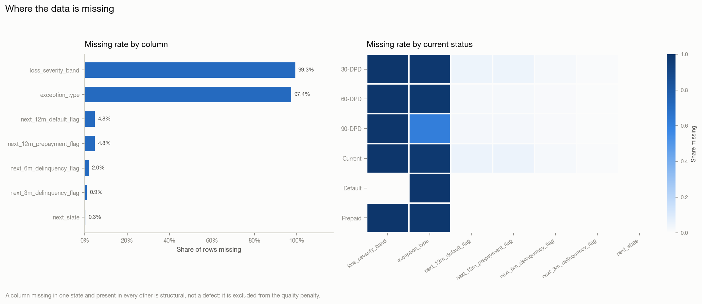
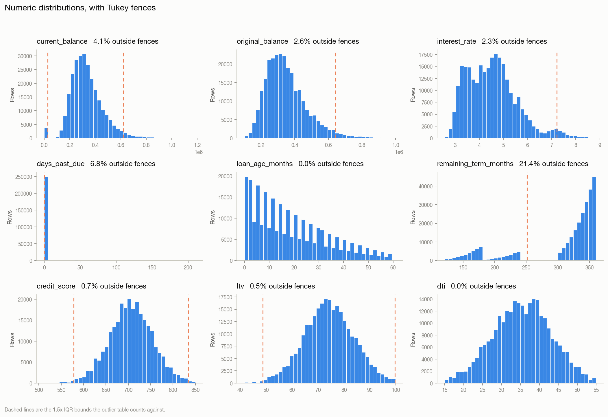
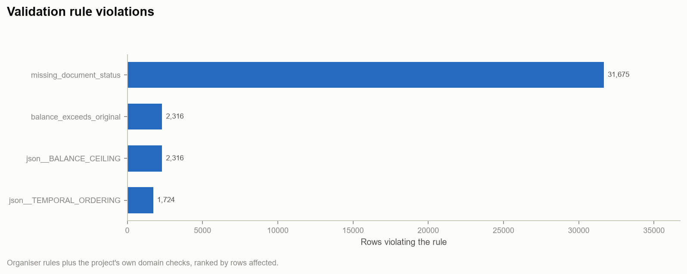
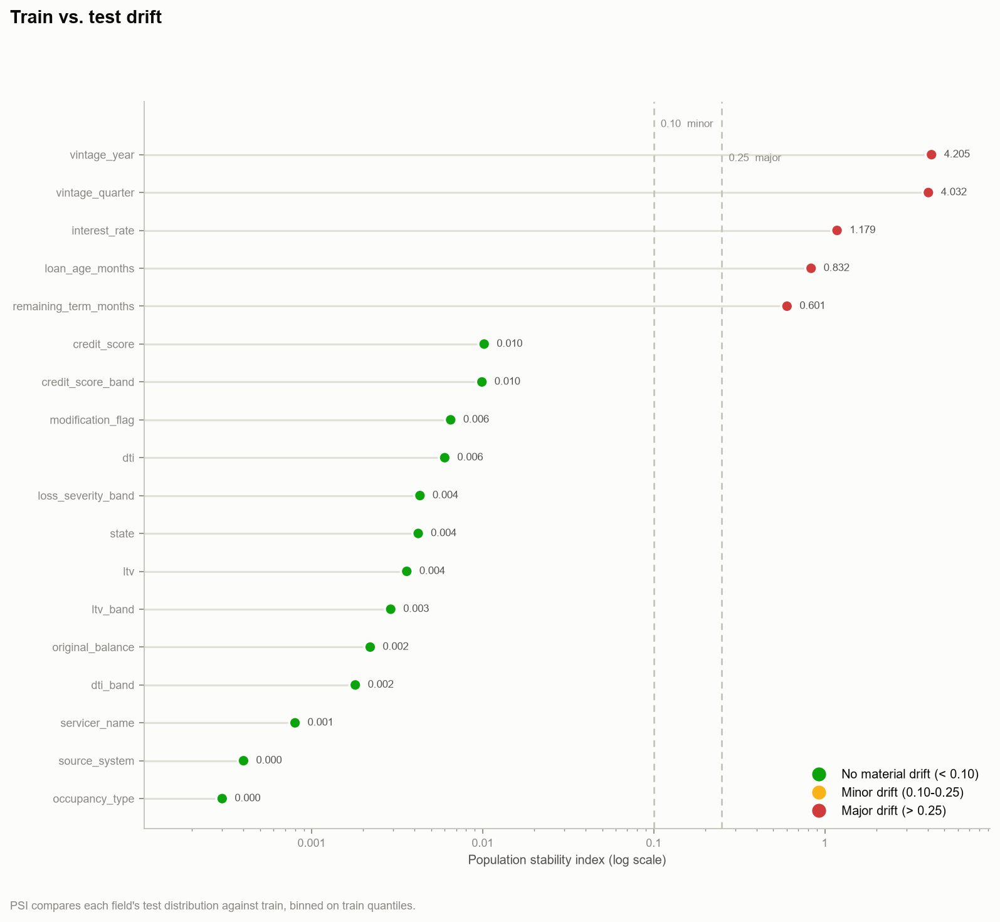
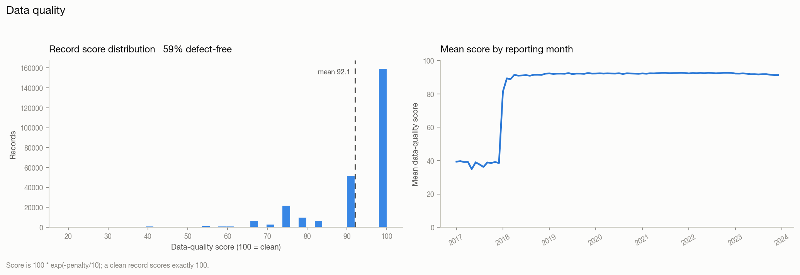

# Data Intelligence Report - Loan Performance Intelligence Engine

_Generated 2026-08-29 23:53:49_

## Scope

Profiling of the loan-level monthly panel prior to any model training. Covers distributions, missingness, outliers and invalid date relationships, cross-column relationship breaks, field dependencies, train/test drift, source reconciliation, and record- and batch-level data-quality scoring.

Every finding below is reproduced by `python scripts/run_profiling.py`.

## Dataset overview

| Metric | Value |
| :--- | ---: |
| Train rows | 268,125 |
| Train columns | 39 |
| Test rows | 78,409 |
| Unique loans (train) | 10,000 |
| Reporting period (train) | 2017-01-01 00:00:00 to 2023-12-01 00:00:00 |
| Reporting period (test) | 2024-01-01 00:00:00 to 2025-08-01 00:00:00 |
| Data dictionary fields parsed | 38 |
| Organiser validation rules loaded | 14 |

## Top data-quality issues

1. **missing_document_status** (low): 31,675 records (11.8135%) - document_status missing or explicitly incomplete
2. **json__BALANCE_CEILING** (high): 2,316 records (0.8638%) - Balance may not exceed the original balance absent a capitalising modification.
3. **balance_exceeds_original** (high): 2,316 records (0.8638%) - current_balance greater than original_balance without a modification flag
4. **json__TEMPORAL_ORDERING** (high): 1,724 records (0.643%) - A performance record may not predate origination.
5. **loss_severity_band** is 99.311% missing.
6. **exception_type** is 97.372% missing.
7. **next_12m_prepayment_flag** is 4.816% missing.
8. **188 rows are dated before the earliest origination in the book** (2017-01, 2017-02, 2017-03, 2017-04, 2017-05, 2017-06, 2017-07, 2017-08, 2017-09, 2017-10, 2017-11, 2017-12) - corrupted timestamps describing months in which no loan existed.
9. **15,640 records conflict with the servicer feed.**

## 1. Column distributions

One row per column: dtype, cardinality, missingness, and the distribution summary appropriate to its type.

| column                   | dtype          |   n_missing |   pct_missing |   n_unique | top_values                                                                                                                                                                                                |   is_constant |        mean |         std | min                 |        p01 |        p25 |        p50 |        p75 |        p99 | max                 |     skew |   n_zero |   n_negative |   n_true |   pct_true |
|:-------------------------|:---------------|------------:|--------------:|-----------:|:----------------------------------------------------------------------------------------------------------------------------------------------------------------------------------------------------------|--------------:|------------:|------------:|:--------------------|-----------:|-----------:|-----------:|-----------:|-----------:|:--------------------|---------:|---------:|-------------:|---------:|-----------:|
| loan_id                  | object         |           0 |         0     |      10000 | 7QQM1UJV6V2F=62 (0.0%); XFVSFD44QQD5=62 (0.0%); BV2N8A1RB1FU=61 (0.0%); 7S7HZCN11GEB=60 (0.0%); 2RJGGDRTOEN3=60 (0.0%)                                                                                    |             0 |    nan      |    nan      | nan                 |    nan     |    nan     |    nan     |    nan     |    nan     | nan                 | nan      |      nan |          nan |      nan |    nan     |
| month_index              | int64          |           0 |         0     |         62 | nan                                                                                                                                                                                                       |           nan |     18.8734 |     14.7273 | 0.0                 |      0     |      7     |     16     |     29     |     56     | 61.0                |   0.737  |    10000 |            0 |      nan |    nan     |
| reporting_month          | datetime64[ns] |           0 |         0     |         84 | nan                                                                                                                                                                                                       |           nan |    nan      |    nan      | 2017-01-01 00:00:00 |    nan     |    nan     |    nan     |    nan     |    nan     | 2023-12-01 00:00:00 | nan      |      nan |          nan |      nan |    nan     |
| origination_month        | datetime64[ns] |           0 |         0     |         72 | nan                                                                                                                                                                                                       |           nan |    nan      |    nan      | 2018-01-01 00:00:00 |    nan     |    nan     |    nan     |    nan     |    nan     | 2023-12-01 00:00:00 | nan      |      nan |          nan |      nan |    nan     |
| loan_age_months          | int64          |           0 |         0     |         62 | nan                                                                                                                                                                                                       |           nan |     18.8734 |     14.7273 | 0.0                 |      0     |      7     |     16     |     29     |     56     | 61.0                |   0.737  |    10000 |            0 |      nan |    nan     |
| remaining_term_months    | int64          |           0 |         0     |        180 | nan                                                                                                                                                                                                       |           nan |    307.66   |     67.2042 | 121.0               |    136     |    311     |    338     |    351     |    360     | 360.0               |  -1.4364 |        0 |            0 |      nan |    nan     |
| original_balance         | float64        |           0 |         0     |        673 | nan                                                                                                                                                                                                       |           nan | 349286      | 123000      | 101000.0            | 150000     | 262000     | 328000     | 414000     | 742000     | 1000000.0           |   1.1021 |        0 |            0 |      nan |    nan     |
| current_balance          | float64        |           0 |         0     |     241645 | nan                                                                                                                                                                                                       |           nan | 332756      | 125764      | 0.0                 |      0     | 249519     | 315838     | 398053     | 721050     | 1184702.9           |   0.7959 |     3813 |            0 |      nan |    nan     |
| interest_rate            | float64        |           0 |         0     |       4259 | nan                                                                                                                                                                                                       |           nan |      4.5356 |      1.0378 | 2.57                |      2.903 |      3.708 |      4.476 |      5.111 |      7.601 | 8.836               |   0.7945 |        0 |            0 |      nan |    nan     |
| credit_score_band        | object         |           0 |         0     |          6 | 700-739=83037 (31.0%); 660-699=77806 (29.0%); 740-799=56905 (21.2%); 620-659=32673 (12.2%); <620=10446 (3.9%)                                                                                             |             0 |    nan      |    nan      | nan                 |    nan     |    nan     |    nan     |    nan     |    nan     | nan                 | nan      |      nan |          nan |      nan |    nan     |
| ltv_band                 | object         |           0 |         0     |          5 | 60-75%=126411 (47.1%); 80-90%=58374 (21.8%); 75-80%=51779 (19.3%); <60%=18403 (6.9%); 90-97%=13158 (4.9%)                                                                                                 |             0 |    nan      |    nan      | nan                 |    nan     |    nan     |    nan     |    nan     |    nan     | nan                 | nan      |      nan |          nan |      nan |    nan     |
| dti_band                 | object         |           0 |         0     |          4 | 36-43%=83579 (31.2%); 30-36%=74201 (27.7%); <30%=66250 (24.7%); >43%=44095 (16.4%)                                                                                                                        |             0 |    nan      |    nan      | nan                 |    nan     |    nan     |    nan     |    nan     |    nan     | nan                 | nan      |      nan |          nan |      nan |    nan     |
| state                    | object         |           0 |         0     |         30 | CA=33266 (12.4%); TX=27749 (10.3%); FL=26949 (10.1%); NY=15620 (5.8%); OH=11989 (4.5%)                                                                                                                    |             0 |    nan      |    nan      | nan                 |    nan     |    nan     |    nan     |    nan     |    nan     | nan                 | nan      |      nan |          nan |      nan |    nan     |
| loan_purpose             | object         |           0 |         0     |          3 | Home Purchase=162291 (60.5%); Rate/Term Refinance=65213 (24.3%); Cash-Out Refinance=40621 (15.2%)                                                                                                         |             0 |    nan      |    nan      | nan                 |    nan     |    nan     |    nan     |    nan     |    nan     | nan                 | nan      |      nan |          nan |      nan |    nan     |
| property_type            | object         |           0 |         0     |          3 | Single-Family Detached=199042 (74.2%); Condominium=42134 (15.7%); PUD=26949 (10.1%)                                                                                                                       |             0 |    nan      |    nan      | nan                 |    nan     |    nan     |    nan     |    nan     |    nan     | nan                 | nan      |      nan |          nan |      nan |    nan     |
| occupancy_type           | object         |           0 |         0     |          3 | Primary Residence=227744 (84.9%); Investment Property=26651 (9.9%); Second Home=13730 (5.1%)                                                                                                              |             0 |    nan      |    nan      | nan                 |    nan     |    nan     |    nan     |    nan     |    nan     | nan                 | nan      |      nan |          nan |      nan |    nan     |
| servicer_name            | object         |           0 |         0     |          5 | Cornerstone Loan Servicing=54508 (20.3%); Meridian Residential Capital=54208 (20.2%); Atlas Mortgage Services=53903 (20.1%); Beacon Home Loans=52795 (19.7%); Northgate Financial Servicing=52711 (19.7%) |             0 |    nan      |    nan      | nan                 |    nan     |    nan     |    nan     |    nan     |    nan     | nan                 | nan      |      nan |          nan |      nan |    nan     |
| vintage_year             | int64          |           0 |         0     |          6 | nan                                                                                                                                                                                                       |           nan |   2019.73   |      1.4576 | 2018.0              |   2018     |   2018     |   2020     |   2021     |   2023     | 2023.0              |   0.4794 |        0 |            0 |      nan |    nan     |
| current_status           | object         |           0 |         0     |          6 | Current=247973 (92.5%); 30-DPD=8456 (3.2%); 90-DPD=4441 (1.7%); 60-DPD=3442 (1.3%); Prepaid=1965 (0.7%)                                                                                                   |             0 |    nan      |    nan      | nan                 |    nan     |    nan     |    nan     |    nan     |    nan     | nan                 | nan      |      nan |          nan |      nan |    nan     |
| days_past_due            | int64          |           0 |         0     |        182 | nan                                                                                                                                                                                                       |           nan |      5.2354 |     22.0567 | 0.0                 |      0     |      0     |      0     |      0     |    114     | 210.0               |   5.031  |   249938 |            0 |      nan |    nan     |
| modification_flag        | bool           |           0 |         0     |          2 | nan                                                                                                                                                                                                       |           nan |    nan      |    nan      | nan                 |    nan     |    nan     |    nan     |    nan     |    nan     | nan                 | nan      |      nan |          nan |     4570 |      1.704 |
| prepayment_flag          | int64          |           0 |         0     |          2 | nan                                                                                                                                                                                                       |           nan |      0.0073 |      0.0853 | 0.0                 |      0     |      0     |      0     |      0     |      0     | 1.0                 |  11.5525 |   266160 |            0 |      nan |    nan     |
| default_flag             | int64          |           0 |         0     |          2 | nan                                                                                                                                                                                                       |           nan |      0.0069 |      0.0827 | 0.0                 |      0     |      0     |      0     |      0     |      0     | 1.0                 |  11.9205 |   266277 |            0 |      nan |    nan     |
| loss_severity_band       | object         |      266277 |        99.311 |          3 | Medium=832 (0.3%); Low=632 (0.2%); High=384 (0.1%)                                                                                                                                                        |             0 |    nan      |    nan      | nan                 |    nan     |    nan     |    nan     |    nan     |    nan     | nan                 | nan      |      nan |          nan |      nan |    nan     |
| last_updated_at          | datetime64[ns] |           0 |         0     |       1997 | nan                                                                                                                                                                                                       |           nan |    nan      |    nan      | 2018-01-03 00:00:00 |    nan     |    nan     |    nan     |    nan     |    nan     | 2025-06-21 00:00:00 | nan      |      nan |          nan |      nan |    nan     |
| source_system            | object         |           0 |         0     |          3 | CoreServicing=193514 (72.2%); VendorAPI=49582 (18.5%); LegacySFTP=25029 (9.3%)                                                                                                                            |             0 |    nan      |    nan      | nan                 |    nan     |    nan     |    nan     |    nan     |    nan     | nan                 | nan      |      nan |          nan |      nan |    nan     |
| document_status          | object         |           0 |         0     |          3 | Complete=236450 (88.2%); Pending=24502 (9.1%); Missing=7173 (2.7%)                                                                                                                                        |             0 |    nan      |    nan      | nan                 |    nan     |    nan     |    nan     |    nan     |    nan     | nan                 | nan      |      nan |          nan |      nan |    nan     |
| next_3m_delinquency_flag | float64        |        2450 |         0.914 |          2 | nan                                                                                                                                                                                                       |           nan |      0.1116 |      0.3148 | 0.0                 |      0     |      0     |      0     |      0     |      1     | 1.0                 |   2.4678 |   236038 |            0 |      nan |    nan     |
| next_6m_delinquency_flag | float64        |        5390 |         2.01  |          2 | nan                                                                                                                                                                                                       |           nan |      0.082  |      0.2743 | 0.0                 |      0     |      0     |      0     |      0     |      1     | 1.0                 |   3.0479 |   241200 |            0 |      nan |    nan     |
| next_12m_default_flag    | float64        |       12913 |         4.816 |          2 | nan                                                                                                                                                                                                       |           nan |      0.0861 |      0.2805 | 0.0                 |      0     |      0     |      0     |      0     |      1     | 1.0                 |   2.9509 |   233236 |            0 |      nan |    nan     |
| next_12m_prepayment_flag | float64        |       12913 |         4.816 |          2 | nan                                                                                                                                                                                                       |           nan |      0.0852 |      0.2791 | 0.0                 |      0     |      0     |      0     |      0     |      1     | 1.0                 |   2.9724 |   233477 |            0 |      nan |    nan     |
| next_state               | object         |         767 |         0.286 |          6 | Current=243378 (90.8%); 30-DPD=8650 (3.2%); Prepaid=4636 (1.7%); Default=4386 (1.6%); 60-DPD=3500 (1.3%)                                                                                                  |             0 |    nan      |    nan      | nan                 |    nan     |    nan     |    nan     |    nan     |    nan     | nan                 | nan      |      nan |          nan |      nan |    nan     |
| exception_required       | bool           |           0 |         0     |          2 | nan                                                                                                                                                                                                       |           nan |    nan      |    nan      | nan                 |    nan     |    nan     |    nan     |    nan     |    nan     | nan                 | nan      |      nan |          nan |     7046 |      2.628 |
| exception_type           | object         |      261079 |        97.372 |          4 | Balance Discrepancy=2316 (0.9%); Time Travel=1724 (0.6%); Impossible State Transition=1687 (0.6%); Zombie Loan=1319 (0.5%)                                                                                |             0 |    nan      |    nan      | nan                 |    nan     |    nan     |    nan     |    nan     |    nan     | nan                 | nan      |      nan |          nan |      nan |    nan     |
| vintage_quarter          | object         |           0 |         0     |         24 | 2018Q1=18049 (6.7%); 2018Q4=17746 (6.6%); 2019Q2=17430 (6.5%); 2018Q3=17056 (6.4%); 2018Q2=16349 (6.1%)                                                                                                   |             0 |    nan      |    nan      | nan                 |    nan     |    nan     |    nan     |    nan     |    nan     | nan                 | nan      |      nan |          nan |      nan |    nan     |
| credit_score             | int64          |           0 |         0     |        302 | nan                                                                                                                                                                                                       |           nan |    705.855  |     48.1487 | 512.0               |    590     |    674     |    706     |    738     |    818     | 850.0               |  -0.0428 |        0 |            0 |      nan |    nan     |
| ltv                      | float64        |           0 |         0     |       3685 | nan                                                                                                                                                                                                       |           nan |     74.1603 |      9.52   | 41.71               |     51.44  |     67.82  |     74.03  |     80.55  |     95.69  | 99.87               |  -0.05   |        0 |            0 |      nan |    nan     |
| dti                      | float64        |           0 |         0     |       3074 | nan                                                                                                                                                                                                       |           nan |     35.4111 |      7.6173 | 15.0                |     18.02  |     30.11  |     35.53  |     40.63  |     52.01  | 54.91               |  -0.0598 |        0 |            0 |      nan |    nan     |
| original_term_months     | int64          |           0 |         0     |          3 | nan                                                                                                                                                                                                       |           nan |    326.526  |     65.5444 | 180.0               |    180     |    360     |    360     |    360     |    360     | 360.0               |  -1.5378 |        0 |            0 |      nan |    nan     |

## 2. Missing-value patterns

Columns with at least one missing value, worst first.

| column                   |   n_missing |   pct_missing |
|:-------------------------|------------:|--------------:|
| loss_severity_band       |      266277 |        99.311 |
| exception_type           |      261079 |        97.372 |
| next_12m_prepayment_flag |       12913 |         4.816 |
| next_12m_default_flag    |       12913 |         4.816 |
| next_6m_delinquency_flag |        5390 |         2.01  |
| next_3m_delinquency_flag |        2450 |         0.914 |
| next_state               |         767 |         0.286 |

### Missingness co-occurrence

Columns whose missing-indicators correlate: a high value means the fields go missing together, which points at one upstream process dropping a block of fields rather than independent gaps.

| column_a                 | column_b                 |   missing_corr |
|:-------------------------|:-------------------------|---------------:|
| next_12m_default_flag    | next_12m_prepayment_flag |         1      |
| next_3m_delinquency_flag | next_6m_delinquency_flag |         0.6705 |
| next_6m_delinquency_flag | next_12m_default_flag    |         0.6368 |
| next_6m_delinquency_flag | next_12m_prepayment_flag |         0.6368 |
| next_3m_delinquency_flag | next_12m_default_flag    |         0.4269 |
| next_3m_delinquency_flag | next_12m_prepayment_flag |         0.4269 |
| next_12m_default_flag    | exception_type           |        -0.02   |
| next_12m_prepayment_flag | exception_type           |        -0.02   |
| loss_severity_band       | next_12m_default_flag    |         0.0187 |
| loss_severity_band       | next_12m_prepayment_flag |         0.0187 |
| next_6m_delinquency_flag | exception_type           |        -0.0147 |
| loss_severity_band       | next_6m_delinquency_flag |         0.0119 |
| next_3m_delinquency_flag | exception_type           |        -0.0112 |
| loss_severity_band       | exception_type           |        -0.0109 |
| loss_severity_band       | next_3m_delinquency_flag |         0.008  |

### Structured (by-design) missingness

Near-total missingness within a segment is almost always intentional (e.g. loss severity is only populated once a loan defaults). These are excluded from the defect narrative so they don't inflate the quality penalty.

| column             | segment                |   pct_missing | verdict                                     |
|:-------------------|:-----------------------|--------------:|:--------------------------------------------|
| loss_severity_band | current_status=30-DPD  |        100    | likely structural (by design), not a defect |
| exception_type     | current_status=30-DPD  |         98.26 | likely structural (by design), not a defect |
| loss_severity_band | current_status=60-DPD  |        100    | likely structural (by design), not a defect |
| exception_type     | current_status=60-DPD  |         98.55 | likely structural (by design), not a defect |
| loss_severity_band | current_status=90-DPD  |        100    | likely structural (by design), not a defect |
| loss_severity_band | current_status=Current |        100    | likely structural (by design), not a defect |
| exception_type     | current_status=Current |         97.95 | likely structural (by design), not a defect |
| exception_type     | current_status=Default |         99.46 | likely structural (by design), not a defect |
| loss_severity_band | current_status=Prepaid |        100    | likely structural (by design), not a defect |
| exception_type     | current_status=Prepaid |         99.13 | likely structural (by design), not a defect |

## 3. Outliers (Tukey IQR fences)

Numeric columns ranked by the share of rows outside 1.5x IQR.

| column                   | method      |   lower_fence |   upper_fence |   n_outliers |   pct_outliers |
|:-------------------------|:------------|--------------:|--------------:|-------------:|---------------:|
| original_term_months     | IQR (k=1.5) |      360      |      360      |        57419 |         21.415 |
| remaining_term_months    | IQR (k=1.5) |      251      |      411      |        57419 |         21.415 |
| next_3m_delinquency_flag | IQR (k=1.5) |        0      |        0      |        29637 |         11.053 |
| next_12m_default_flag    | IQR (k=1.5) |        0      |        0      |        21976 |          8.196 |
| next_12m_prepayment_flag | IQR (k=1.5) |        0      |        0      |        21735 |          8.106 |
| next_6m_delinquency_flag | IQR (k=1.5) |        0      |        0      |        21535 |          8.032 |
| days_past_due            | IQR (k=1.5) |        0      |        0      |        18187 |          6.783 |
| current_balance          | IQR (k=1.5) |    26718.2    |   620853      |        11072 |          4.129 |
| original_balance         | IQR (k=1.5) |    34000      |   642000      |         7020 |          2.618 |
| interest_rate            | IQR (k=1.5) |        1.6035 |        7.2155 |         6097 |          2.274 |
| prepayment_flag          | IQR (k=1.5) |        0      |        0      |         1965 |          0.733 |
| credit_score             | IQR (k=1.5) |      578      |      834      |         1917 |          0.715 |
| default_flag             | IQR (k=1.5) |        0      |        0      |         1848 |          0.689 |
| ltv                      | IQR (k=1.5) |       48.725  |       99.645  |         1237 |          0.461 |
| loan_age_months          | IQR (k=1.5) |      -26      |       62      |            0 |          0     |
| vintage_year             | IQR (k=1.5) |     2013.5    |     2025.5    |            0 |          0     |
| dti                      | IQR (k=1.5) |       14.33   |       56.41   |            0 |          0     |
| month_index              | IQR (k=1.5) |      -26      |       62      |            0 |          0     |

### Outliers (robust z-score)

Median/MAD-based second opinion, less sensitive to the outliers it is hunting.

| column                | method             |   n_outliers |   pct_outliers |
|:----------------------|:-------------------|-------------:|---------------:|
| remaining_term_months | robust z (|z|>4.0) |        57419 |         21.415 |
| current_balance       | robust z (|z|>4.0) |         2186 |          0.815 |
| original_balance      | robust z (|z|>4.0) |         2178 |          0.812 |
| interest_rate         | robust z (|z|>4.0) |           79 |          0.029 |
| credit_score          | robust z (|z|>4.0) |           14 |          0.005 |
| month_index           | robust z (|z|>4.0) |            0 |          0     |
| loan_age_months       | robust z (|z|>4.0) |            0 |          0     |
| vintage_year          | robust z (|z|>4.0) |            0 |          0     |
| ltv                   | robust z (|z|>4.0) |            0 |          0     |
| dti                   | robust z (|z|>4.0) |            0 |          0     |

### Invalid date relationships

Loan-specific temporal consistency checks.

| check                              |   n_violations |   pct_violations |
|:-----------------------------------|---------------:|-----------------:|
| origination_after_reporting        |           1724 |            0.643 |
| last_update_before_reporting_month |              0 |            0     |
| loan_age_inconsistent_with_dates   |           1718 |            0.641 |
| reporting_month_in_future          |              0 |            0     |

### Reporting months that predate the book

**188 rows** are dated before the earliest origination in the entire portfolio, so they describe months in which no loan existed. These are corrupted timestamps, not early history. They are easy to miss because they sit at the edge of the calendar and look like a thin warm-up period -- and they are why the mean data-quality score is depressed for the earliest reporting periods rather than for any particular servicer or field.

| reporting_month   |   rows |   loans | earliest_origination_in_book   |
|:------------------|-------:|--------:|:-------------------------------|
| 2017-01           |      3 |       3 | 2018-01                        |
| 2017-02           |      4 |       4 | 2018-01                        |
| 2017-03           |      7 |       7 | 2018-01                        |
| 2017-04           |     10 |      10 | 2018-01                        |
| 2017-05           |     11 |      11 | 2018-01                        |
| 2017-06           |     11 |      11 | 2018-01                        |
| 2017-07           |     23 |      23 | 2018-01                        |
| 2017-08           |     23 |      23 | 2018-01                        |
| 2017-09           |     21 |      21 | 2018-01                        |
| 2017-10           |     27 |      26 | 2018-01                        |
| 2017-11           |     26 |      26 | 2018-01                        |
| 2017-12           |     22 |      22 | 2018-01                        |

## 4. Cross-column relationship breaks

14 rule(s) loaded from the organiser's `validation_rules.json` plus 14 additional domain rules written for this engine. A violation means two fields on the same record contradict each other.

| rule                                  | description                                                                     | severity   | applicable   |   n_violations |   pct_violations |
|:--------------------------------------|:--------------------------------------------------------------------------------|:-----------|:-------------|---------------:|-----------------:|
| missing_document_status               | document_status missing or explicitly incomplete                                | low        | True         |          31675 |          11.8135 |
| json__BALANCE_CEILING                 | Balance may not exceed the original balance absent a capitalising modification. | high       | True         |           2316 |           0.8638 |
| balance_exceeds_original              | current_balance greater than original_balance without a modification flag       | high       | True         |           2316 |           0.8638 |
| json__TEMPORAL_ORDERING               | A performance record may not predate origination.                               | high       | True         |           1724 |           0.643  |
| json__LOAN_ID_PRESENT                 | Every remittance record must carry a loan identifier.                           | high       | True         |              0 |           0      |
| json__REPORTING_MONTH_PRESENT         | Every record must carry a reporting period.                                     | high       | True         |              0 |           0      |
| json__BALANCE_SIGN                    | Unpaid principal balance may not be negative.                                   | high       | True         |              0 |           0      |
| json__DPD_RANGE                       | Days past due must fall within a plausible reporting range.                     | medium     | True         |              0 |           0      |
| json__STATUS_DOMAIN                   | Performance status must be a recognised state.                                  | high       | True         |              0 |           0      |
| json__SEQUENTIAL_DELINQUENCY          | Delinquency status and days past due must agree; buckets may not be skipped.    | high       | True         |              0 |           0      |
| json__ABSORBING_STATE_FINALITY        | A prepaid or defaulted loan is terminal and must carry a zero balance.          | high       | True         |              0 |           0      |
| json__DEFAULT_DELINQUENCY_CONSISTENCY | A defaulted loan must be at least 90 days delinquent.                           | high       | True         |              0 |           0      |
| json__RATE_RANGE                      | Note rate must fall within a plausible range.                                   | medium     | True         |              0 |           0      |
| json__TERM_NON_NEGATIVE               | Remaining term may not be negative.                                             | medium     | True         |              0 |           0      |
| json__MUTUALLY_EXCLUSIVE_TERMINATION  | A loan cannot both default and prepay in the same period.                       | high       | True         |              0 |           0      |
| json__DOCUMENT_STATUS_DOMAIN          | Document status must be a recognised value.                                     | low        | True         |              0 |           0      |
| negative_balance                      | current_balance is negative                                                     | high       | True         |              0 |           0      |
| prepaid_with_positive_balance         | prepayment_flag set but current_balance is still materially above zero          | high       | True         |              0 |           0      |
| default_without_delinquency           | default_flag set but days_past_due is below the 90-day default threshold        | high       | True         |              0 |           0      |
| delinquent_but_current_status         | days_past_due > 0 while current_status reads as current/performing              | high       | True         |              0 |           0      |
| current_status_but_high_dpd           | current_status says current while days_past_due exceeds 30                      | medium     | True         |              0 |           0      |
| closed_status_with_balance            | loan marked closed/prepaid/liquidated yet carries a balance                     | high       | True         |              0 |           0      |
| negative_remaining_term               | remaining_term_months is negative                                               | high       | True         |              0 |           0      |
| implausible_interest_rate             | interest_rate outside a plausible 0-25% band                                    | medium     | True         |              0 |           0      |
| negative_loan_age                     | loan_age_months is negative                                                     | high       | True         |              0 |           0      |
| dpd_implausibly_large                 | days_past_due exceeds 1080 (three years) -- likely a unit or sentinel error     | medium     | True         |              0 |           0      |
| default_and_prepaid_together          | default_flag and prepayment_flag both set on the same record                    | high       | True         |              0 |           0      |
| zero_original_balance                 | original_balance is zero or negative                                            | high       | True         |              0 |           0      |

## 5. Strongly correlated numeric fields

Spearman rank correlation (monotone, robust to the skew loan balances always carry). |rho| >= 0.7 only.

| column_a                 | column_b              |   correlation |
|:-------------------------|:----------------------|--------------:|
| month_index              | loan_age_months       |        1      |
| original_balance         | current_balance       |        0.9612 |
| next_6m_delinquency_flag | next_12m_default_flag |        0.7446 |
| remaining_term_months    | original_term_months  |        0.7156 |

### Categorical dependencies

Bias-corrected Cramer's V. Plain chi-square inflates on high-cardinality fields like `state`, so the correction matters here.

| column_a       | column_b       |   cramers_v |
|:---------------|:---------------|------------:|
| current_status | next_state     |      0.6116 |
| current_status | exception_type |      0.5747 |
| next_state     | exception_type |      0.5513 |

### Numeric-vs-categorical dependencies

Correlation ratio (eta): the share of a numeric field's variance explained by a categorical field.

| categorical       | numeric                  |    eta |
|:------------------|:-------------------------|-------:|
| vintage_quarter   | vintage_year             | 1      |
| current_status    | prepayment_flag          | 1      |
| current_status    | default_flag             | 1      |
| current_status    | days_past_due            | 0.9904 |
| credit_score_band | credit_score             | 0.9639 |
| exception_type    | days_past_due            | 0.9534 |
| dti_band          | dti                      | 0.9442 |
| ltv_band          | ltv                      | 0.9377 |
| vintage_quarter   | interest_rate            | 0.9181 |
| next_state        | days_past_due            | 0.7827 |
| next_state        | next_3m_delinquency_flag | 0.7044 |
| next_state        | prepayment_flag          | 0.6478 |
| next_state        | default_flag             | 0.646  |
| next_state        | next_6m_delinquency_flag | 0.6102 |
| next_state        | next_12m_default_flag    | 0.4871 |
| current_status    | next_6m_delinquency_flag | 0.4805 |
| current_status    | next_3m_delinquency_flag | 0.4416 |
| vintage_quarter   | month_index              | 0.4207 |
| vintage_quarter   | loan_age_months          | 0.4207 |
| exception_type    | current_balance          | 0.4205 |

### Redundancy candidates

Near-duplicate columns (|rho| >= 0.95). Keeping both splits importance across twins in tree models, and a near-perfect correlation with a target is a leakage smell worth checking before training: `current_balance`, `loan_age_months`

## 6. Train vs. test drift

Population Stability Index per shared column, with a KS test (numeric) or category-share comparison (categorical) as a second opinion. Conventional bands: PSI < 0.10 stable, 0.10-0.25 moderate, > 0.25 major.

| column                | type        | train_min           | train_max           | test_min            | test_max            |      psi | drift_band   |   train_pct_missing |   test_pct_missing |   ks_statistic |   ks_pvalue |   train_mean |   test_mean |   unseen_in_test | missing_in_test                |
|:----------------------|:------------|:--------------------|:--------------------|:--------------------|:--------------------|---------:|:-------------|--------------------:|-------------------:|---------------:|------------:|-------------:|------------:|-----------------:|:-------------------------------|
| vintage_year          | numeric     | nan                 | nan                 | nan                 | nan                 |   4.205  | MAJOR shift  |               0     |              0     |         0.4776 |   0         |    2019.73   |   2021.59   |              nan | nan                            |
| vintage_quarter       | categorical | nan                 | nan                 | nan                 | nan                 |   4.0323 | MAJOR shift  |               0     |              0     |       nan      | nan         |     nan      |    nan      |                  | 2018Q1; 2018Q2; 2018Q3; 2018Q4 |
| interest_rate         | numeric     | nan                 | nan                 | nan                 | nan                 |   1.1793 | MAJOR shift  |               0     |              0     |         0.3547 |   0         |       4.5356 |      5.2988 |              nan | nan                            |
| loan_age_months       | numeric     | nan                 | nan                 | nan                 | nan                 |   0.8316 | MAJOR shift  |               0     |              0     |         0.3198 |   0         |      18.8734 |     30.7965 |              nan | nan                            |
| remaining_term_months | numeric     | nan                 | nan                 | nan                 | nan                 |   0.6012 | MAJOR shift  |               0     |              0     |         0.2526 |   0         |     307.66   |    296.346  |              nan | nan                            |
| credit_score          | numeric     | nan                 | nan                 | nan                 | nan                 |   0.0102 | stable       |               0     |              0     |         0.0408 |   2.307e-88 |     705.855  |    709.639  |              nan | nan                            |
| credit_score_band     | categorical | nan                 | nan                 | nan                 | nan                 |   0.0099 | stable       |               0     |              0     |       nan      | nan         |     nan      |    nan      |                  |                                |
| modification_flag     | numeric     | nan                 | nan                 | nan                 | nan                 |   0.0065 | stable       |               0     |              0     |         0.0119 |   6.472e-08 |       0.017  |      0.029  |              nan | nan                            |
| dti                   | numeric     | nan                 | nan                 | nan                 | nan                 |   0.006  | stable       |               0     |              0     |         0.0224 |   7.123e-27 |      35.4111 |     35.2903 |              nan | nan                            |
| loss_severity_band    | categorical | nan                 | nan                 | nan                 | nan                 |   0.0043 | stable       |              99.311 |             99.279 |       nan      | nan         |     nan      |    nan      |                  |                                |
| state                 | categorical | nan                 | nan                 | nan                 | nan                 |   0.0042 | stable       |               0     |              0     |       nan      | nan         |     nan      |    nan      |                  |                                |
| ltv                   | numeric     | nan                 | nan                 | nan                 | nan                 |   0.0036 | stable       |               0     |              0     |         0.0181 |   9.371e-18 |      74.1603 |     73.7202 |              nan | nan                            |
| ltv_band              | categorical | nan                 | nan                 | nan                 | nan                 |   0.0029 | stable       |               0     |              0     |       nan      | nan         |     nan      |    nan      |                  |                                |
| original_balance      | numeric     | nan                 | nan                 | nan                 | nan                 |   0.0022 | stable       |               0     |              0     |         0.0102 |   6.584e-06 |  349286      | 346848      |              nan | nan                            |
| dti_band              | categorical | nan                 | nan                 | nan                 | nan                 |   0.0018 | stable       |               0     |              0     |       nan      | nan         |     nan      |    nan      |                  |                                |
| servicer_name         | categorical | nan                 | nan                 | nan                 | nan                 |   0.0008 | stable       |               0     |              0     |       nan      | nan         |     nan      |    nan      |                  |                                |
| source_system         | categorical | nan                 | nan                 | nan                 | nan                 |   0.0004 | stable       |               0     |              0     |       nan      | nan         |     nan      |    nan      |                  |                                |
| occupancy_type        | categorical | nan                 | nan                 | nan                 | nan                 |   0.0003 | stable       |               0     |              0     |       nan      | nan         |     nan      |    nan      |                  |                                |
| original_term_months  | numeric     | nan                 | nan                 | nan                 | nan                 |   0.0001 | stable       |               0     |              0     |         0.0036 |   0.4238    |     326.526  |    327.135  |              nan | nan                            |
| document_status       | categorical | nan                 | nan                 | nan                 | nan                 |   0.0001 | stable       |               0     |              0     |       nan      | nan         |     nan      |    nan      |                  |                                |
| loan_purpose          | categorical | nan                 | nan                 | nan                 | nan                 |   0      | stable       |               0     |              0     |       nan      | nan         |     nan      |    nan      |                  |                                |
| property_type         | categorical | nan                 | nan                 | nan                 | nan                 |   0      | stable       |               0     |              0     |       nan      | nan         |     nan      |    nan      |                  |                                |
| prepayment_flag       | numeric     | nan                 | nan                 | nan                 | nan                 |   0      | stable       |               0     |              0     |         0.0005 |   1         |       0.0073 |      0.0078 |              nan | nan                            |
| current_status        | categorical | nan                 | nan                 | nan                 | nan                 |   0      | stable       |               0     |              0     |       nan      | nan         |     nan      |    nan      |                  |                                |
| default_flag          | numeric     | nan                 | nan                 | nan                 | nan                 |   0      | stable       |               0     |              0     |         0.0003 |   1         |       0.0069 |      0.0072 |              nan | nan                            |
| reporting_month       | datetime    | 2017-01-01 00:00:00 | 2023-12-01 00:00:00 | 2024-01-01 00:00:00 | 2025-08-01 00:00:00 | nan      | n/a          |               0     |              0     |       nan      | nan         |     nan      |    nan      |              nan | nan                            |
| origination_month     | datetime    | 2018-01-01 00:00:00 | 2023-12-01 00:00:00 | 2019-01-01 00:00:00 | 2023-12-01 00:00:00 | nan      | n/a          |               0     |              0     |       nan      | nan         |     nan      |    nan      |              nan | nan                            |
| days_past_due         | numeric     | nan                 | nan                 | nan                 | nan                 | nan      | n/a          |               0     |              0     |         0.001  |   1         |       5.2354 |      5.3054 |              nan | nan                            |
| last_updated_at       | datetime    | 2018-01-03 00:00:00 | 2025-06-21 00:00:00 | 2024-01-03 00:00:00 | 2025-08-23 00:00:00 | nan      | n/a          |               0     |              0     |       nan      | nan         |     nan      |    nan      |              nan | nan                            |

### Columns with major drift

These shifted materially between train and test. Either the feature needs re-binning, or the model needs the scoring period represented in training - otherwise the time-aware validation will look optimistic relative to the actual scoring run: `vintage_year`, `vintage_quarter`, `interest_rate`, `loan_age_months`, `remaining_term_months`

### Drift within the training window

Each reporting period measured against the first. This is the check that tells you whether a time-aware split will behave, and which vintages look unlike the scoring period.

| period   | column                |   psi_vs_first_period | drift_band   |
|:---------|:----------------------|----------------------:|:-------------|
| 2023-12  | vintage_year          |               26.0522 | MAJOR shift  |
| 2017-02  | ltv                   |               25.146  | MAJOR shift  |
| 2017-02  | original_balance      |               25.146  | MAJOR shift  |
| 2017-02  | current_balance       |               25.146  | MAJOR shift  |
| 2017-02  | interest_rate         |               25.146  | MAJOR shift  |
| 2017-02  | dti                   |               25.146  | MAJOR shift  |
| 2017-03  | month_index           |               25.0485 | MAJOR shift  |
| 2017-03  | loan_age_months       |               25.0485 | MAJOR shift  |
| 2017-04  | month_index           |               24.8304 | MAJOR shift  |
| 2017-04  | loan_age_months       |               24.8304 | MAJOR shift  |
| 2017-03  | original_balance      |               24.7844 | MAJOR shift  |
| 2017-05  | month_index           |               24.7225 | MAJOR shift  |
| 2017-05  | loan_age_months       |               24.7225 | MAJOR shift  |
| 2017-06  | month_index           |               24.5965 | MAJOR shift  |
| 2017-06  | loan_age_months       |               24.5965 | MAJOR shift  |
| 2017-03  | remaining_term_months |               24.5864 | MAJOR shift  |
| 2017-03  | current_balance       |               24.5864 | MAJOR shift  |
| 2017-03  | dti                   |               24.5864 | MAJOR shift  |
| 2017-03  | interest_rate         |               24.5864 | MAJOR shift  |
| 2017-03  | ltv                   |               24.5864 | MAJOR shift  |

## 7. Source conflicts vs. servicer feed

Fields where the monthly panel and the servicer feed disagree on the same (loan, month). Numeric fields use a 1% relative tolerance so float noise isn't reported as a conflict.

| field           |   n_compared |   n_conflicts |   pct_conflicts |
|:----------------|-------------:|--------------:|----------------:|
| current_balance |        67166 |         12043 |         17.9302 |
| current_status  |        67166 |          4424 |          6.5867 |
| days_past_due   |        67166 |             0 |          0      |
| servicer_name   |        67166 |             0 |          0      |

### Example conflicting records

| loan_id      | reporting_month     | conflict__current_balance   | conflict__current_status   | conflict__days_past_due   | conflict__servicer_name   |   current_balance |   current_balance__servicer | current_status   | current_status__servicer   |   days_past_due |   days_past_due__servicer | servicer_name                 | servicer_name__servicer       |
|:-------------|:--------------------|:----------------------------|:---------------------------|:--------------------------|:--------------------------|------------------:|----------------------------:|:-----------------|:---------------------------|----------------:|--------------------------:|:------------------------------|:------------------------------|
| 00AS0B0L7ZXZ | 2023-05-01 00:00:00 | True                        | False                      | False                     | False                     |            366000 |                      404100 | Current          | Current                    |               0 |                         0 | Atlas Mortgage Services       | Atlas Mortgage Services       |
| 00QUQ6CC3XP6 | 2023-02-01 00:00:00 | True                        | False                      | False                     | False                     |            360000 |                      409374 | Current          | Current                    |               0 |                         0 | Atlas Mortgage Services       | Atlas Mortgage Services       |
| 00VQAED35X9M | 2018-10-01 00:00:00 | False                       | True                       | False                     | False                     |            511506 |                      511506 | Current          | 30-DPD                     |               0 |                         0 | Northgate Financial Servicing | Northgate Financial Servicing |
| 00VQAED35X9M | 2019-04-01 00:00:00 | False                       | True                       | False                     | False                     |            507551 |                      507551 | Current          | 60-DPD                     |               0 |                         0 | Northgate Financial Servicing | Northgate Financial Servicing |
| 00VQAED35X9M | 2019-05-01 00:00:00 | False                       | True                       | False                     | False                     |            506882 |                      506882 | Current          | 60-DPD                     |               0 |                         0 | Northgate Financial Servicing | Northgate Financial Servicing |
| 00VQAED35X9M | 2020-05-01 00:00:00 | True                        | True                       | False                     | False                     |            498644 |                      520040 | Current          | 60-DPD                     |               0 |                         0 | Northgate Financial Servicing | Northgate Financial Servicing |
| 01N5YE6DXOTM | 2022-01-01 00:00:00 | True                        | False                      | False                     | False                     |            424849 |                      477028 | Current          | Current                    |               0 |                         0 | Beacon Home Loans             | Beacon Home Loans             |
| 01VBP5L2G464 | 2019-06-01 00:00:00 | True                        | False                      | False                     | False                     |            409371 |                      436357 | Current          | Current                    |               0 |                         0 | Northgate Financial Servicing | Northgate Financial Servicing |
| 01VBP5L2G464 | 2020-01-01 00:00:00 | True                        | False                      | False                     | False                     |            397805 |                      429715 | Current          | Current                    |               0 |                         0 | Northgate Financial Servicing | Northgate Financial Servicing |
| 01WRA2JT2XXP | 2018-03-01 00:00:00 | False                       | True                       | False                     | False                     |            334000 |                      334000 | Current          | 60-DPD                     |               0 |                         0 | Cornerstone Loan Servicing    | Cornerstone Loan Servicing    |
| 02E6VDTFGYQQ | 2022-03-01 00:00:00 | True                        | False                      | False                     | False                     |            349347 |                      405524 | Current          | Current                    |               0 |                         0 | Atlas Mortgage Services       | Atlas Mortgage Services       |
| 02E6VDTFGYQQ | 2023-02-01 00:00:00 | False                       | True                       | False                     | False                     |            345627 |                      345627 | Current          | 30-DPD                     |               0 |                         0 | Atlas Mortgage Services       | Atlas Mortgage Services       |
| 02FUCNCSIY51 | 2022-10-01 00:00:00 | False                       | True                       | False                     | False                     |            496477 |                      496477 | Current          | 60-DPD                     |               0 |                         0 | Meridian Residential Capital  | Meridian Residential Capital  |
| 02JETCV63HB1 | 2023-09-01 00:00:00 | True                        | False                      | False                     | False                     |            365823 |                      417274 | Current          | Current                    |               0 |                         0 | Meridian Residential Capital  | Meridian Residential Capital  |
| 02TGRY9XTVPI | 2021-05-01 00:00:00 | False                       | True                       | False                     | False                     |            327711 |                      327711 | Current          | 30-DPD                     |               0 |                         0 | Meridian Residential Capital  | Meridian Residential Capital  |

### Duplicate panel rows

**22 rows** duplicate an existing (loan_id, reporting_month) pair. A loan should appear once per month; anything else breaks the panel structure and will quietly corrupt a time-aware split if not de-duplicated first.

## 8. Batch-level data-quality score

| Metric | Value |
| :--- | ---: |
| Batch DQ score (0-100, mean) | 92.14 |
| Median record score | 100.0 |
| 5th percentile record score | 67.03 |
| Records with zero defects | 59.47% |
| Records in 'critical' band | 0.32% |
| Records 'poor' or worse | 5.44% |
| Records with a rule violation | 35,238 |
| Records with a date violation | 1,724 |
| Stale records | 0 |
| Records with a source conflict | 15,640 |

### Scoring method

Each defect signal contributes a weighted penalty (rule violation 3.0, source conflict 2.5, missing critical field 2.0, stale record 1.5, outlier 1.0, missing non-critical field 0.5). The total penalty maps to a 0-100 score via `100 * exp(-penalty / 10)`, so a clean record scores exactly 100 and the scale degrades smoothly without a hand-tuned maximum. Weights live in `src/config.py` and should be re-tuned once the real defect mix is known.

The per-record reason string is kept alongside the score, so a reviewer sees *which* defects drove it - that is what makes this score usable as an anomaly feature in Task 4 and as grounding for the copilot in Task 7, rather than an opaque number.

Conditionally-populated columns excluded from the missingness penalty (blank by design, not a defect): `loss_severity_band`.

### Data quality by servicer_name

Worst-scoring segment first. This is the view that turns a portfolio-level number into an action.

| servicer_name                 |   n_records |   mean_dq_score |   pct_with_rule_violation |   n_stale |   n_source_conflict |
|:------------------------------|------------:|----------------:|--------------------------:|----------:|--------------------:|
| Cornerstone Loan Servicing    |       54508 |           91.54 |                     15.23 |         0 |                3284 |
| Meridian Residential Capital  |       54208 |           92.14 |                     12.69 |         0 |                3007 |
| Beacon Home Loans             |       52795 |           92.26 |                     12.77 |         0 |                3088 |
| Northgate Financial Servicing |       52711 |           92.35 |                     12.84 |         0 |                3111 |
| Atlas Mortgage Services       |       53903 |           92.42 |                     12.14 |         0 |                3150 |

### Worst 25 records

Lowest data-quality scores with their specific defects. These seed the reviewer-ready anomaly examples required in Task 4.

| loan_id      | reporting_month     |   dq_score | dq_band   |   penalty | dq_reasons                                                                                                                                                                                                 |
|:-------------|:--------------------|-----------:|:----------|----------:|:-----------------------------------------------------------------------------------------------------------------------------------------------------------------------------------------------------------|
| ZMVS8H7S3EGD | 2023-06-01 00:00:00 |      19.2  | critical  |      16.5 | rule:json__TEMPORAL_ORDERING; rule:missing_document_status; date:origination_after_reporting; date:loan_age_inconsistent; outlier:remaining_term_months; outlier:interest_rate; source_conflict            |
| ZMVS8H7S3EGD | 2023-11-01 00:00:00 |      19.2  | critical  |      16.5 | rule:json__TEMPORAL_ORDERING; rule:missing_document_status; date:origination_after_reporting; date:loan_age_inconsistent; outlier:remaining_term_months; outlier:interest_rate; source_conflict            |
| 482BADKKEGM4 | 2022-12-01 00:00:00 |      21.22 | critical  |      15.5 | rule:json__TEMPORAL_ORDERING; rule:missing_document_status; date:origination_after_reporting; date:loan_age_inconsistent; outlier:interest_rate; source_conflict                                           |
| MS64XFD9Y0UF | 2020-11-01 00:00:00 |      21.22 | critical  |      15.5 | rule:json__TEMPORAL_ORDERING; rule:missing_document_status; date:origination_after_reporting; date:loan_age_inconsistent; outlier:remaining_term_months; source_conflict                                   |
| PLN6WAU1S4JE | 2023-01-01 00:00:00 |      21.22 | critical  |      15.5 | rule:json__TEMPORAL_ORDERING; rule:missing_document_status; date:origination_after_reporting; date:loan_age_inconsistent; outlier:interest_rate; source_conflict                                           |
| T5BO3RJNQPPP | 2022-02-01 00:00:00 |      21.22 | critical  |      15.5 | rule:json__TEMPORAL_ORDERING; rule:missing_document_status; date:origination_after_reporting; date:loan_age_inconsistent; outlier:remaining_term_months; source_conflict                                   |
| WDRBQ0QBQ686 | 2023-08-01 00:00:00 |      21.22 | critical  |      15.5 | rule:json__TEMPORAL_ORDERING; rule:missing_document_status; date:origination_after_reporting; date:loan_age_inconsistent; outlier:interest_rate; source_conflict                                           |
| S93DW6EUGV4C | 2022-03-01 00:00:00 |      22.31 | critical  |      15   | rule:json__TEMPORAL_ORDERING; rule:missing_document_status; date:origination_after_reporting; date:loan_age_inconsistent; outlier:remaining_term_months; outlier:original_balance; outlier:current_balance |
| 3FB4VEUTFSSZ | 2019-04-01 00:00:00 |      23.46 | critical  |      14.5 | rule:json__TEMPORAL_ORDERING; rule:missing_document_status; date:origination_after_reporting; date:loan_age_inconsistent; source_conflict                                                                  |
| 410E9M9SHP92 | 2019-09-01 00:00:00 |      23.46 | critical  |      14.5 | rule:json__TEMPORAL_ORDERING; rule:missing_document_status; date:origination_after_reporting; date:loan_age_inconsistent; source_conflict                                                                  |
| 4JP7ZJF4Y8AV | 2020-12-01 00:00:00 |      23.46 | critical  |      14.5 | rule:json__TEMPORAL_ORDERING; rule:missing_document_status; date:origination_after_reporting; date:loan_age_inconsistent; source_conflict                                                                  |
| 5190WXPEHCEQ | 2020-10-01 00:00:00 |      23.46 | critical  |      14.5 | rule:json__TEMPORAL_ORDERING; rule:missing_document_status; date:origination_after_reporting; date:loan_age_inconsistent; source_conflict                                                                  |
| G89743XTRHGJ | 2018-03-01 00:00:00 |      23.46 | critical  |      14.5 | rule:json__TEMPORAL_ORDERING; rule:missing_document_status; date:origination_after_reporting; date:loan_age_inconsistent; source_conflict                                                                  |
| L3ONVMTX2XJ4 | 2019-05-01 00:00:00 |      23.46 | critical  |      14.5 | rule:json__TEMPORAL_ORDERING; rule:missing_document_status; date:origination_after_reporting; date:loan_age_inconsistent; source_conflict                                                                  |
| NMP66JGYCZDK | 2019-08-01 00:00:00 |      23.46 | critical  |      14.5 | rule:json__TEMPORAL_ORDERING; rule:missing_document_status; date:origination_after_reporting; date:loan_age_inconsistent; source_conflict                                                                  |
| NQYW5HY285SH | 2022-01-01 00:00:00 |      23.46 | critical  |      14.5 | rule:json__TEMPORAL_ORDERING; rule:missing_document_status; date:origination_after_reporting; date:loan_age_inconsistent; source_conflict                                                                  |
| VLLJ8EDQH7N6 | 2022-02-01 00:00:00 |      23.46 | critical  |      14.5 | rule:json__TEMPORAL_ORDERING; rule:missing_document_status; date:origination_after_reporting; date:loan_age_inconsistent; source_conflict                                                                  |
| Z3FKXJLHU0KK | 2020-04-01 00:00:00 |      23.46 | critical  |      14.5 | rule:json__TEMPORAL_ORDERING; rule:missing_document_status; date:origination_after_reporting; date:loan_age_inconsistent; source_conflict                                                                  |
| 3NL36RFX7L1Z | 2017-12-01 00:00:00 |      24.66 | critical  |      14   | rule:json__TEMPORAL_ORDERING; rule:missing_document_status; date:origination_after_reporting; date:loan_age_inconsistent; outlier:remaining_term_months; outlier:current_balance                           |
| 9C2IW95BWI3T | 2018-08-01 00:00:00 |      24.66 | critical  |      14   | rule:json__TEMPORAL_ORDERING; rule:missing_document_status; date:origination_after_reporting; date:loan_age_inconsistent; outlier:original_balance; outlier:current_balance                                |
| IRGL51YLQH05 | 2023-08-01 00:00:00 |      24.66 | critical  |      14   | rule:json__TEMPORAL_ORDERING; rule:missing_document_status; date:origination_after_reporting; date:loan_age_inconsistent; outlier:remaining_term_months; outlier:interest_rate                             |
| J42M6INYVX25 | 2018-09-01 00:00:00 |      24.66 | critical  |      14   | rule:json__TEMPORAL_ORDERING; rule:missing_document_status; date:origination_after_reporting; date:loan_age_inconsistent; outlier:remaining_term_months; outlier:current_balance                           |
| LC6O385UQHQL | 2022-05-01 00:00:00 |      24.66 | critical  |      14   | rule:json__TEMPORAL_ORDERING; rule:missing_document_status; date:origination_after_reporting; date:loan_age_inconsistent; outlier:remaining_term_months; outlier:interest_rate                             |
| R12EPVXCE84B | 2017-08-01 00:00:00 |      24.66 | critical  |      14   | rule:json__TEMPORAL_ORDERING; rule:missing_document_status; date:origination_after_reporting; date:loan_age_inconsistent; outlier:original_balance; outlier:current_balance                                |
| R28F9BTFDWKF | 2020-04-01 00:00:00 |      24.66 | critical  |      14   | rule:json__TEMPORAL_ORDERING; rule:missing_document_status; date:origination_after_reporting; date:loan_age_inconsistent; outlier:remaining_term_months; outlier:current_balance                           |

## 9. Figures

**Where the data is missing**

**Numeric distributions**

**Validation rule violations**

**Train vs. test drift**

**Data quality**

## 10. Feature dictionary

59 modelling features (48 numeric, 11 categorical). The baseline model sees 7 of them; the improved model sees all of them.

**Information window** is the guarantee that matters. `as-at t` uses only the reporting month's own record; `t-k..t` is a backward-looking window ending at month t inclusive; `month t` is cross-sectional across loans within the same month. No feature reads a month after t. That claim is enforced, not asserted: `features.assert_no_leaky_features` hard-fails on any label-derived column, and `tests/test_leakage_controls.py` rebuilds the matrix on a panel truncated after month t and requires every rolling feature at t to be unchanged.

Rolling windows are computed on a gap-free monthly grid, so a "3-month window" is three *calendar* months even where the panel is missing a month.

## static (14)

_Fixed at origination; identical for every month of a loan's life._

| feature              | information_window   | dtype       | baseline   |   % present | definition                                     |
|:---------------------|:---------------------|:------------|:-----------|------------:|:-----------------------------------------------|
| credit_score         | origination          | numeric     | False      |         100 | Borrower FICO at origination (500-850).        |
| credit_score_band    | origination          | categorical | True       |         100 | Credit score bucket.                           |
| dti                  | origination          | numeric     | False      |         100 | Debt-to-income at origination, percent.        |
| dti_band             | origination          | categorical | False      |         100 | DTI bucket.                                    |
| interest_rate        | origination          | numeric     | True       |         100 | Annual fixed note rate, percent.               |
| loan_purpose         | origination          | categorical | False      |         100 | Purchase, rate/term refinance, or cash-out.    |
| ltv                  | origination          | numeric     | False      |         100 | Loan-to-value at origination, percent.         |
| ltv_band             | origination          | categorical | False      |         100 | LTV bucket.                                    |
| occupancy_type       | origination          | categorical | False      |         100 | Primary residence, investment, or second home. |
| original_balance     | origination          | numeric     | False      |         100 | Unpaid principal balance at origination, USD.  |
| original_term_months | origination          | numeric     | False      |         100 | Contractual term at origination.               |
| property_type        | origination          | categorical | False      |         100 | Single-family, condominium, or PUD.            |
| state                | origination          | categorical | False      |         100 | US state of the mortgaged property.            |
| vintage_year         | origination          | numeric     | False      |         100 | Calendar year of origination.                  |

## contemporaneous (17)

_The state of the loan as at the reporting month._

| feature               | information_window   | dtype       | baseline   |   % present | definition                                                                                                                                              |
|:----------------------|:---------------------|:------------|:-----------|------------:|:--------------------------------------------------------------------------------------------------------------------------------------------------------|
| balance_gap_abs       | as-at t              | numeric     | False      |         100 | current_balance - expected_balance, in USD.                                                                                                             |
| balance_ratio         | as-at t              | numeric     | True       |         100 | current_balance / original_balance: how much principal is left.                                                                                         |
| balance_vs_expected   | as-at t              | numeric     | False      |         100 | current_balance / expected_balance. Below 1 means paying down faster than schedule; a large deviation is also the Balance Discrepancy defect signature. |
| current_balance       | as-at t              | numeric     | True       |         100 | Unpaid principal balance, USD.                                                                                                                          |
| current_status        | as-at t              | categorical | True       |         100 | Performance state: Current / 30 / 60 / 90-DPD.                                                                                                          |
| days_past_due         | as-at t              | numeric     | True       |         100 | Days delinquent at the reporting month.                                                                                                                 |
| doc_status_ordinal    | as-at t              | numeric     | False      |         100 | document_status encoded Complete < Pending < Missing.                                                                                                   |
| document_status       | as-at t              | categorical | False      |         100 | Document file completeness.                                                                                                                             |
| is_delinquent         | as-at t              | numeric     | False      |         100 | 1 where days_past_due > 0.                                                                                                                              |
| loan_age_months       | as-at t              | numeric     | True       |         100 | Months elapsed since origination.                                                                                                                       |
| month_cos             | as-at t              | numeric     | False      |         100 | Second component of the cyclical month encoding.                                                                                                        |
| month_sin             | as-at t              | numeric     | False      |         100 | Cyclical encoding of the calendar month, so December and January are adjacent.                                                                          |
| remaining_term_months | as-at t              | numeric     | False      |         100 | Contractual months remaining.                                                                                                                           |
| servicer_name         | as-at t              | categorical | False      |         100 | Institution servicing the loan this month.                                                                                                              |
| source_system         | as-at t              | categorical | False      |         100 | System of record that produced the row.                                                                                                                 |
| status_ordinal        | as-at t              | numeric     | False      |         100 | current_status encoded worst-last, so a tree can split on severity.                                                                                     |
| term_progress         | as-at t              | numeric     | False      |         100 | loan_age_months / original_term_months: position in the amortisation schedule.                                                                          |

## cross-sectional (2)

_The loan's position relative to every other loan reporting that month._

| feature                 | information_window   | dtype   | baseline   |   % present | definition                                                                                               |
|:------------------------|:---------------------|:--------|:-----------|------------:|:---------------------------------------------------------------------------------------------------------|
| balance_pctile_in_month | month t              | numeric | False      |         100 | Percentile rank of current_balance within month t.                                                       |
| rate_spread             | month t              | numeric | False      |         100 | interest_rate minus the month's median rate: the refinance incentive, and the main driver of prepayment. |

## rolling (25)

_Derived from the loan's own history up to and including month t._

| feature                    | information_window   | dtype   | baseline   |   % present | definition                                                                         |
|:---------------------------|:---------------------|:--------|:-----------|------------:|:-----------------------------------------------------------------------------------|
| delinquent_months_to_date  | 0..t                 | numeric | False      |      100    | Count of months with days_past_due > 0 so far.                                     |
| doc_status_changes_to_date | 0..t                 | numeric | False      |      100    | Count of document-status changes so far.                                           |
| dpd_delta_1m               | t-1..t               | numeric | False      |       95.25 | Change in days_past_due between month t-1 and month t.                             |
| dpd_delta_3m               | t-3..t               | numeric | False      |       88.12 | Change in days_past_due between month t-3 and month t.                             |
| dpd_delta_6m               | t-6..t               | numeric | False      |       77.99 | Change in days_past_due between month t-6 and month t.                             |
| dpd_lag_1m                 | t-1..t               | numeric | False      |       95.25 | days_past_due as at month t-1.                                                     |
| dpd_lag_3m                 | t-3..t               | numeric | False      |       88.12 | days_past_due as at month t-3.                                                     |
| dpd_lag_6m                 | t-6..t               | numeric | False      |       77.99 | days_past_due as at month t-6.                                                     |
| dpd_max_12m                | t-12..t              | numeric | False      |      100    | Maximum days_past_due over the last 12 calendar months, inclusive of t.            |
| dpd_max_3m                 | t-3..t               | numeric | False      |      100    | Maximum days_past_due over the last 3 calendar months, inclusive of t.             |
| dpd_max_6m                 | t-6..t               | numeric | False      |      100    | Maximum days_past_due over the last 6 calendar months, inclusive of t.             |
| dpd_mean_12m               | t-12..t              | numeric | False      |      100    | Mean days_past_due over the last 12 calendar months, inclusive of t.               |
| dpd_mean_3m                | t-3..t               | numeric | False      |      100    | Mean days_past_due over the last 3 calendar months, inclusive of t.                |
| dpd_mean_6m                | t-6..t               | numeric | False      |      100    | Mean days_past_due over the last 6 calendar months, inclusive of t.                |
| modified_ever              | 0..t                 | numeric | False      |      100    | 1 once the loan has received a loss-mitigation modification.                       |
| months_since_delinquency   | 0..t                 | numeric | False      |        6.78 | Months since the most recent delinquent month; 0 if delinquent now, null if never. |
| months_since_modification  | 0..t                 | numeric | False      |        1.7  | Months since the modification; null if never modified.                             |
| paydown_1m                 | t-1..t               | numeric | False      |       95    | Proportional change in current_balance between month t-1 and month t.              |
| paydown_3m                 | t-3..t               | numeric | False      |       88.12 | Proportional change in current_balance between month t-3 and month t.              |
| paydown_6m                 | t-6..t               | numeric | False      |       77.98 | Proportional change in current_balance between month t-6 and month t.              |
| servicer_transfers_to_date | 0..t                 | numeric | False      |      100    | Count of servicer changes so far.                                                  |
| source_changes_to_date     | 0..t                 | numeric | False      |      100    | Count of source-system changes so far.                                             |
| status_changed_this_month  | t-1..t               | numeric | False      |      100    | 1 where the status differs from last month.                                        |
| status_changes_to_date     | 0..t                 | numeric | False      |      100    | Count of month-on-month status transitions so far.                                 |
| worst_status_to_date       | 0..t                 | numeric | False      |      100    | Running maximum of status_ordinal.                                                 |

## quality (1)

_Phase 1 data-quality signal for the record itself._

| feature   | information_window   | dtype   | baseline   |   % present | definition                                                                                                                             |
|:----------|:---------------------|:--------|:-----------|------------:|:---------------------------------------------------------------------------------------------------------------------------------------|
| dq_score  | as-at t              | numeric | False      |         100 | Phase 1 record-level data-quality score (100 = clean). A record the profiler distrusts is a record whose reported status may be wrong. |

