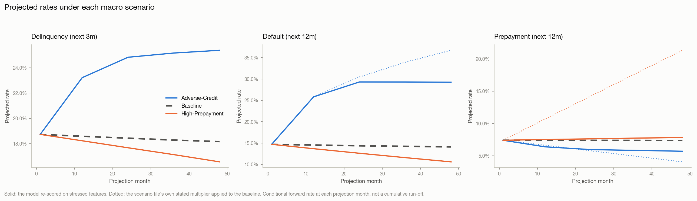
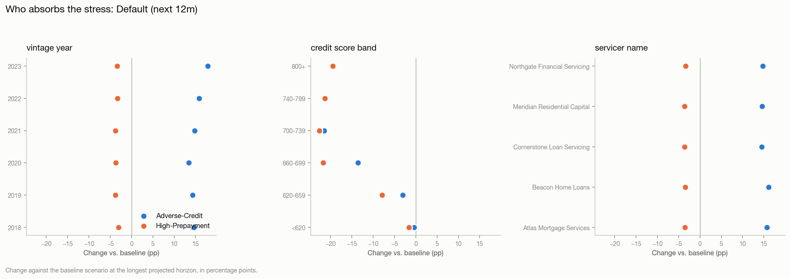
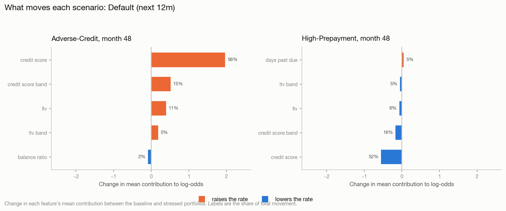

# Scenario & Stress Simulation Report (Task 5)

_Generated 2026-08-29 15:03:51_

## What this projects

The book's 10,000 loans at their latest observed position, re-scored under each macro scenario through the Phase 3 `improved` models. Delinquency, default and prepayment, portfolio-wide and by segment, with the movement attributed to features.

## Scope and limitations

**What these numbers are.** For each scenario and projection month, the
portfolio's features are stressed to that month's assumptions and re-scored
through the Phase 3 models. A figure at horizon 24 is the *conditional forward
rate as at that month*: given the book and the macro state two years out, the
probability a loan defaults over the following twelve months.

**What they are not.** This is a stress-sensitivity projection, not a cash-flow
run-off. The Phase 3 models predict a fixed forward window from a record's own
month; they do not compound, and this pipeline does not pretend they do. The
portfolio is held at its last observed position rather than amortised, loans
that default or prepay are not removed as the horizon extends, and no balance is
rolled forward. The question answered is "how much worse does this book look
under that macro state" -- which is what a stress test is for. The question left
open is "what are the cumulative losses", which needs the Phase 4 hazards and a
run-off engine.

**Scoring population.** The latest observed record per loan: the book as it
stands at the data cutoff. Scoring every historical month would weight the
projection towards loans that happen to have long histories.

## Scenario assumptions

Read directly from `data/macro_scenarios.csv`. Nothing here is a project assumption.

| scenario        |   horizon_month | projection_month   |   mortgage_rate |   unemployment_rate |   hpi_index |   default_multiplier |   prepayment_multiplier |
|:----------------|----------------:|:-------------------|----------------:|--------------------:|------------:|---------------------:|------------------------:|
| Baseline        |               1 | 2024-01            |          6.6    |              3.9    |    100      |               1      |                  1      |
| Baseline        |              12 | 2024-12            |          6.4011 |              3.9702 |    102.747  |               1      |                  1      |
| Baseline        |              24 | 2025-12            |          6.184  |              4.0468 |    105.829  |               1      |                  1      |
| Baseline        |              36 | 2026-12            |          5.967  |              4.1234 |    109.004  |               1      |                  1      |
| Baseline        |              48 | 2027-12            |          5.75   |              4.2    |    112.274  |               1      |                  1      |
| Adverse-Credit  |               1 | 2024-01            |          6.6    |              3.9    |    100      |               1      |                  1      |
| Adverse-Credit  |              12 | 2024-12            |          6.8574 |              5.9319 |     92.6415 |               1.774  |                  0.8947 |
| Adverse-Credit  |              24 | 2025-12            |          7.1383 |              6.8381 |     85.2302 |               2.1193 |                  0.7798 |
| Adverse-Credit  |              36 | 2026-12            |          7.4191 |              7.5244 |     78.4118 |               2.3807 |                  0.6649 |
| Adverse-Credit  |              48 | 2027-12            |          7.7    |              8.1    |     72.1388 |               2.6    |                  0.55   |
| High-Prepayment |               1 | 2024-01            |          6.6    |              3.9    |    100      |               1      |                  1      |
| High-Prepayment |              12 | 2024-12            |          6.0383 |              3.7947 |    105.03   |               0.9415 |                  1.4447 |
| High-Prepayment |              24 | 2025-12            |          5.4255 |              3.6798 |    110.807  |               0.8777 |                  1.9298 |
| High-Prepayment |              36 | 2026-12            |          4.8128 |              3.5649 |    116.901  |               0.8138 |                  2.4149 |
| High-Prepayment |              48 | 2027-12            |          4.2    |              3.45   |    123.331  |               0.75   |                  2.9    |

## Portfolio projection

Mean projected rate per scenario and horizon, with the change against the baseline scenario at the same horizon in percentage points.

| scenario        |   horizon_month | projection_month   |   delinquency_3m |   default_12m |   prepayment_12m |   credit_score_shift |   loans |   delinquency_3m_vs_baseline_pp |   default_12m_vs_baseline_pp |   prepayment_12m_vs_baseline_pp |   default_12m_stated |   prepayment_12m_stated |
|:----------------|----------------:|:-------------------|-----------------:|--------------:|-----------------:|---------------------:|--------:|--------------------------------:|-----------------------------:|--------------------------------:|---------------------:|------------------------:|
| Adverse-Credit  |               1 | 2024-01            |         0.187348 |      0.147149 |        0.0739691 |              0       |   10000 |                        0        |                     0        |                        0        |             0.147149 |               0.0739691 |
| Adverse-Credit  |              12 | 2024-12            |         0.232126 |      0.258286 |        0.0638139 |            -92.5     |   10000 |                        4.62678  |                    11.2752   |                       -1.01684  |             0.258177 |               0.0661919 |
| Adverse-Credit  |              24 | 2025-12            |         0.248229 |      0.293092 |        0.0594882 |           -250       |   10000 |                        6.38539  |                    14.9304   |                       -1.43762  |             0.304729 |               0.0575994 |
| Adverse-Credit  |              36 | 2026-12            |         0.251569 |      0.293021 |        0.0582301 |           -250       |   10000 |                        6.87073  |                    15.0509   |                       -1.55482  |             0.339277 |               0.0490552 |
| Adverse-Credit  |              48 | 2027-12            |         0.253732 |      0.292502 |        0.0569575 |           -250       |   10000 |                        7.20648  |                    15.1278   |                       -1.66593  |             0.367183 |               0.0404892 |
| Baseline        |               1 | 2024-01            |         0.187348 |      0.147149 |        0.0739691 |              0       |   10000 |                        0        |                     0        |                        0        |             0.147149 |               0.0739691 |
| Baseline        |              12 | 2024-12            |         0.185858 |      0.145534 |        0.0739823 |              0       |   10000 |                        0        |                     0        |                        0        |             0.145534 |               0.0739823 |
| Baseline        |              24 | 2025-12            |         0.184375 |      0.143788 |        0.0738644 |              0       |   10000 |                        0        |                     0        |                        0        |             0.143788 |               0.0738644 |
| Baseline        |              36 | 2026-12            |         0.182862 |      0.142512 |        0.0737784 |              0       |   10000 |                        0        |                     0        |                        0        |             0.142512 |               0.0737784 |
| Baseline        |              48 | 2027-12            |         0.181667 |      0.141224 |        0.0736168 |              0       |   10000 |                        0        |                     0        |                        0        |             0.141224 |               0.0736168 |
| High-Prepayment |               1 | 2024-01            |         0.187348 |      0.147149 |        0.0739691 |              0       |   10000 |                        0        |                     0        |                        0        |             0.147149 |               0.0739691 |
| High-Prepayment |              12 | 2024-12            |         0.182317 |      0.136935 |        0.0751222 |              7.00002 |   10000 |                       -0.354173 |                    -0.859906 |                        0.113995 |             0.13702  |               0.106882  |
| High-Prepayment |              24 | 2025-12            |         0.176802 |      0.126277 |        0.0761378 |             14.5     |   10000 |                       -0.757333 |                    -1.75102  |                        0.227341 |             0.126202 |               0.142543  |
| High-Prepayment |              36 | 2026-12            |         0.171383 |      0.116034 |        0.0773279 |             22.5     |   10000 |                       -1.14783  |                    -2.6478   |                        0.354955 |             0.115976 |               0.178167  |
| High-Prepayment |              48 | 2027-12            |         0.165682 |      0.106172 |        0.0782029 |             31.5     |   10000 |                       -1.59851  |                    -3.50524  |                        0.458608 |             0.105918 |               0.213489  |

## Method

**The scenario file is the only source of stress assumptions.** Nothing in this
pipeline invents an unemployment path, a rate shock or an elasticity.
`data/macro_scenarios.csv` supplies, per scenario and month, a mortgage rate, an
unemployment rate, a house price index and the scenario's own stated default and
prepayment multipliers. A missing column stops the run rather than falling back
to a default.

**Three transmission channels, in descending order of how much they assume.**

*House prices to loan-to-value* is mechanical. LTV is debt over value, so a
house price index at 72 against a starting 100 raises current LTV by a factor of
1.39. No elasticity, no fitted relationship -- arithmetic.

*Market rate to refinance incentive* is mechanical. `rate_spread` is the loan's
note rate less the prevailing market rate, and the scenario states that rate. A
borrower paying 7% in a 4.2% market has an incentive the Phase 3 model already
knows how to read.

*Labour market to credit quality* is *calibrated, not assumed*. The file gives
an unemployment path and a default multiplier but no elasticity connecting them
to credit scores. Hard-coding one -- "40 points of FICO per point of
unemployment" -- would make the projection a restatement of that invented
number. Instead the shift is solved for: find the portfolio-wide credit-score
move that makes the model reproduce the scenario's *own* stated default
multiplier. The file stays authoritative, the model supplies the transmission,
and the answer lands in a unit a credit officer recognises.

**Bounds are enforced and banded columns are rebuilt.** Every stressed feature is
clipped to a plausible range, and `credit_score_band`, `ltv_band` and `dti_band`
are recomputed from the shifted values underneath them. Moving `ltv` while
leaving `ltv_band` at its original level hands the model a record that
contradicts itself -- and the model will score it without complaint.

**One credit shift per scenario-month, shared across all three targets.** The
shift describes a state of the world, not a per-model tuning knob. Letting each
target solve its own would produce three mutually inconsistent portfolios and
call them one scenario.

## Where this projection runs out of road

**The credit channel saturates, and the projection says so.** Beyond a point,
no shift in credit score reproduces the default multiplier the scenario file
states. Even moving the entire book to the floor of the observable score range
(500) leaves the Adverse-Credit multiplier short at the longer horizons. Three
readings, all worth stating:

1. The Phase 3 model's sensitivity to credit score is bounded by the range it
   was fitted on. A 2.6x default multiplier is outside what this book's credit
   distribution can express, however hard it is pushed.
2. The scenario's severity is therefore carried by channels the model does not
   see. Unemployment at 8.1% is not a feature; it reaches the model only
   through the calibrated shift, and the shift has run out of room.
3. A naive calibration would clamp at its search bound, report a number and
   move on -- and the projection would quietly under-state the scenario. The
   saturation table names the shortfall in the file's own units instead.

This is why both projection methods are reported. The **feature-stress** column
is what the model says when its inputs are moved; the **stated-multiplier**
column is the scenario file's own view applied directly to the baseline rate.
Where they diverge, the feature-stress figure is a floor, not a forecast.

**Prepayment barely responds to the rate path.** The High-Prepayment scenario
states a 2.9x prepayment multiplier by month 48; the feature-stress projection
produces roughly 1.05x. That is consistent rather than anomalous: Task 2 found
prepayment close to unpredictable in this pack (ROC-AUC 0.52) and Task 3 found
a cause-specific Cox model barely beating a constant hazard on it (C = 0.558).
A model with no prepayment signal cannot acquire one under stress. The
stated-multiplier column is the usable projection for prepayment here.

## Calibrated credit channel

The portfolio-wide credit-score shift that makes the model reproduce each scenario's stated default multiplier. `converged = False` marks a multiplier the model cannot reach by any shift in the search range -- reported as a number rather than silently clamped.

| scenario        |   horizon_month |   credit_score_shift |   baseline_rate | converged   |     residual |   target_multiplier |   target_rate |   attainable_low |   attainable_high |   attained_rate |   attainable_multiplier |
|:----------------|----------------:|---------------------:|----------------:|:------------|-------------:|--------------------:|--------------:|-----------------:|------------------:|----------------:|------------------------:|
| Adverse-Credit  |               1 |              0       |        0.147149 | True        |  0           |              1      |    nan        |       nan        |       nan         |      nan        |               nan       |
| Adverse-Credit  |              12 |            -92.5     |        0.145534 | True        |  0.000109061 |              1.774  |      0.258177 |         0.290942 |         0.0686103 |        0.258286 |                 1.774   |
| Adverse-Credit  |              24 |           -250       |        0.143788 | False       | -0.011637    |              2.1193 |      0.304729 |         0.293092 |         0.073383  |        0.293092 |                 2.03837 |
| Adverse-Credit  |              36 |           -250       |        0.142512 | False       | -0.0462568   |              2.3807 |      0.339277 |         0.293021 |         0.0752846 |        0.293021 |                 2.05612 |
| Adverse-Credit  |              48 |           -250       |        0.141224 | False       | -0.0746803   |              2.6    |      0.367183 |         0.292502 |         0.0758331 |        0.292502 |                 2.07119 |
| Baseline        |               1 |              0       |        0.147149 | True        |  0           |              1      |    nan        |       nan        |       nan         |      nan        |               nan       |
| Baseline        |              12 |              0       |        0.145534 | True        |  0           |              1      |    nan        |       nan        |       nan         |      nan        |               nan       |
| Baseline        |              24 |              0       |        0.143788 | True        |  0           |              1      |    nan        |       nan        |       nan         |      nan        |               nan       |
| Baseline        |              36 |              0       |        0.142512 | True        |  0           |              1      |    nan        |       nan        |       nan         |      nan        |               nan       |
| Baseline        |              48 |              0       |        0.141224 | True        |  0           |              1      |    nan        |       nan        |       nan         |      nan        |               nan       |
| High-Prepayment |               1 |              0       |        0.147149 | True        |  0           |              1      |    nan        |       nan        |       nan         |      nan        |               nan       |
| High-Prepayment |              12 |              7.00002 |        0.145534 | True        | -8.53427e-05 |              0.9415 |      0.13702  |         0.285713 |         0.0589134 |        0.136935 |                 0.9415  |
| High-Prepayment |              24 |             14.5     |        0.143788 | True        |  7.50426e-05 |              0.8777 |      0.126202 |         0.282919 |         0.0550868 |        0.126277 |                 0.8777  |
| High-Prepayment |              36 |             22.5     |        0.142512 | True        |  5.7621e-05  |              0.8138 |      0.115976 |         0.27999  |         0.052489  |        0.116034 |                 0.8138  |
| High-Prepayment |              48 |             31.5     |        0.141224 | True        |  0.000253636 |              0.75   |      0.105918 |         0.278005 |         0.0515579 |        0.106172 |                 0.75    |

## Credit channel saturation

`reached = False` marks a stated multiplier the model cannot produce by any credit-score shift. `attainable_multiplier` is the ceiling it reaches at the floor of the observable score range, and `shortfall` is the gap the feature-stress projection therefore under-states by.

| scenario        |   horizon_month |   stated_multiplier |   attainable_multiplier |   credit_score_shift | reached   |   shortfall |
|:----------------|----------------:|--------------------:|------------------------:|---------------------:|:----------|------------:|
| Adverse-Credit  |               1 |              1      |               nan       |              0       | True      | nan         |
| Adverse-Credit  |              12 |              1.774  |                 1.774   |            -92.5     | True      |   0         |
| Adverse-Credit  |              24 |              2.1193 |                 2.03837 |           -250       | False     |   0.0809317 |
| Adverse-Credit  |              36 |              2.3807 |                 2.05612 |           -250       | False     |   0.324582  |
| Adverse-Credit  |              48 |              2.6    |                 2.07119 |           -250       | False     |   0.528807  |
| High-Prepayment |               1 |              1      |               nan       |              0       | True      | nan         |
| High-Prepayment |              12 |              0.9415 |                 0.9415  |              7.00002 | True      |   0         |
| High-Prepayment |              24 |              0.8777 |                 0.8777  |             14.5     | True      |   0         |
| High-Prepayment |              36 |              0.8138 |                 0.8138  |             22.5     | True      |   0         |
| High-Prepayment |              48 |              0.75   |                 0.75    |             31.5     | True      |   0         |

## Stated vs. modelled multipliers

Two independent views of the same scenario. Default agrees by construction -- the credit channel was calibrated to make it agree. **Prepayment was not calibrated against anything**, so its column is the model's own view of the refinance response, derived only from the rate path. Where it disagrees with the file, that gap is a finding about the model, not an error in the projection.

| scenario        |   horizon_month | measure        |   stated_multiplier |   model_multiplier |          gap | calibrated   |
|:----------------|----------------:|:---------------|--------------------:|-------------------:|-------------:|:-------------|
| Adverse-Credit  |               1 | default_12m    |              1      |           1        |  0           | True         |
| Adverse-Credit  |               1 | prepayment_12m |              1      |           1        |  0           | False        |
| Adverse-Credit  |              12 | default_12m    |              1.774  |           1.77475  |  0.000749385 | True         |
| Adverse-Credit  |              12 | prepayment_12m |              0.8947 |           0.862556 | -0.0321439   | False        |
| Adverse-Credit  |              24 | default_12m    |              2.1193 |           2.03837  | -0.0809317   | True         |
| Adverse-Credit  |              24 | prepayment_12m |              0.7798 |           0.80537  |  0.0255704   | False        |
| Adverse-Credit  |              36 | default_12m    |              2.3807 |           2.05612  | -0.324582    | True         |
| Adverse-Credit  |              36 | prepayment_12m |              0.6649 |           0.789257 |  0.124357    | False        |
| Adverse-Credit  |              48 | default_12m    |              2.6    |           2.07119  | -0.528807    | True         |
| Adverse-Credit  |              48 | prepayment_12m |              0.55   |           0.773703 |  0.223703    | False        |
| Baseline        |               1 | default_12m    |              1      |           1        |  0           | True         |
| Baseline        |               1 | prepayment_12m |              1      |           1        |  0           | False        |
| Baseline        |              12 | default_12m    |              1      |           1        |  0           | True         |
| Baseline        |              12 | prepayment_12m |              1      |           1        |  0           | False        |
| Baseline        |              24 | default_12m    |              1      |           1        |  0           | True         |
| Baseline        |              24 | prepayment_12m |              1      |           1        |  0           | False        |
| Baseline        |              36 | default_12m    |              1      |           1        |  0           | True         |
| Baseline        |              36 | prepayment_12m |              1      |           1        |  0           | False        |
| Baseline        |              48 | default_12m    |              1      |           1        |  0           | True         |
| Baseline        |              48 | prepayment_12m |              1      |           1        |  0           | False        |
| High-Prepayment |               1 | default_12m    |              1      |           1        |  0           | True         |
| High-Prepayment |               1 | prepayment_12m |              1      |           1        |  0           | False        |
| High-Prepayment |              12 | default_12m    |              0.9415 |           0.940914 | -0.000586412 | True         |
| High-Prepayment |              12 | prepayment_12m |              1.4447 |           1.01541  | -0.429292    | False        |
| High-Prepayment |              24 | default_12m    |              0.8777 |           0.878222 |  0.000521899 | True         |
| High-Prepayment |              24 | prepayment_12m |              1.9298 |           1.03078  | -0.899022    | False        |
| High-Prepayment |              36 | default_12m    |              0.8138 |           0.814204 |  0.000404325 | True         |
| High-Prepayment |              36 | prepayment_12m |              2.4149 |           1.04811  | -1.36679     | False        |
| High-Prepayment |              48 | default_12m    |              0.75   |           0.751796 |  0.00179598  | True         |
| High-Prepayment |              48 | prepayment_12m |              2.9    |           1.0623   | -1.8377      | False        |

### Impact by vintage year

A portfolio-level move spread evenly is a different problem from the same move concentrated in one segment.

| scenario        |   horizon_month |   vintage_year |   delinquency_3m |   default_12m |   prepayment_12m |   loans |   delinquency_3m_vs_baseline_pp |   default_12m_vs_baseline_pp |   prepayment_12m_vs_baseline_pp |
|:----------------|----------------:|---------------:|-----------------:|--------------:|-----------------:|--------:|--------------------------------:|-----------------------------:|--------------------------------:|
| Adverse-Credit  |               1 |           2018 |         0.192632 |      0.147366 |        0.0711064 |    1717 |                         0       |                       0      |                        0        |
| Adverse-Credit  |               1 |           2019 |         0.204635 |      0.158983 |        0.0730412 |    1675 |                         0       |                       0      |                        0        |
| Adverse-Credit  |               1 |           2020 |         0.200443 |      0.163086 |        0.0746924 |    1650 |                         0       |                       0      |                        0        |
| Adverse-Credit  |               1 |           2021 |         0.175539 |      0.145326 |        0.0768797 |    1658 |                         0       |                       0      |                        0        |
| Adverse-Credit  |               1 |           2022 |         0.182492 |      0.138866 |        0.073029  |    1698 |                         0       |                       0      |                        0        |
| Adverse-Credit  |               1 |           2023 |         0.167491 |      0.128795 |        0.0752468 |    1602 |                         0       |                       0      |                        0        |
| Baseline        |               1 |           2018 |         0.192632 |      0.147366 |        0.0711064 |    1717 |                         0       |                       0      |                        0        |
| Baseline        |               1 |           2019 |         0.204635 |      0.158983 |        0.0730412 |    1675 |                         0       |                       0      |                        0        |
| Baseline        |               1 |           2020 |         0.200443 |      0.163086 |        0.0746924 |    1650 |                         0       |                       0      |                        0        |
| Baseline        |               1 |           2021 |         0.175539 |      0.145326 |        0.0768797 |    1658 |                         0       |                       0      |                        0        |
| Baseline        |               1 |           2022 |         0.182492 |      0.138866 |        0.073029  |    1698 |                         0       |                       0      |                        0        |
| Baseline        |               1 |           2023 |         0.167491 |      0.128795 |        0.0752468 |    1602 |                         0       |                       0      |                        0        |
| High-Prepayment |               1 |           2018 |         0.192632 |      0.147366 |        0.0711064 |    1717 |                         0       |                       0      |                        0        |
| High-Prepayment |               1 |           2019 |         0.204635 |      0.158983 |        0.0730412 |    1675 |                         0       |                       0      |                        0        |
| High-Prepayment |               1 |           2020 |         0.200443 |      0.163086 |        0.0746924 |    1650 |                         0       |                       0      |                        0        |
| High-Prepayment |               1 |           2021 |         0.175539 |      0.145326 |        0.0768797 |    1658 |                         0       |                       0      |                        0        |
| High-Prepayment |               1 |           2022 |         0.182492 |      0.138866 |        0.073029  |    1698 |                         0       |                       0      |                        0        |
| High-Prepayment |               1 |           2023 |         0.167491 |      0.128795 |        0.0752468 |    1602 |                         0       |                       0      |                        0        |
| Adverse-Credit  |              12 |           2018 |         0.2354   |      0.256516 |        0.0591136 |    1717 |                         4.44807 |                      11.0297 |                       -1.18733  |
| Adverse-Credit  |              12 |           2019 |         0.247053 |      0.264838 |        0.0629994 |    1675 |                         4.44012 |                      10.731  |                       -0.998402 |
| Adverse-Credit  |              12 |           2020 |         0.239211 |      0.259779 |        0.0658876 |    1650 |                         4.04181 |                       9.7899 |                       -0.875783 |
| Adverse-Credit  |              12 |           2021 |         0.215789 |      0.249531 |        0.0676545 |    1658 |                         4.13472 |                      10.6715 |                       -0.919144 |
| Adverse-Credit  |              12 |           2022 |         0.231188 |      0.255393 |        0.0631011 |    1698 |                         5.05007 |                      11.801  |                       -1.01535  |
| Adverse-Credit  |              12 |           2023 |         0.223615 |      0.263921 |        0.0643478 |    1602 |                         5.67656 |                      13.7047 |                       -1.10137  |
| Baseline        |              12 |           2018 |         0.190919 |      0.146219 |        0.0709869 |    1717 |                         0       |                       0      |                        0        |
| Baseline        |              12 |           2019 |         0.202652 |      0.157528 |        0.0729834 |    1675 |                         0       |                       0      |                        0        |
| Baseline        |              12 |           2020 |         0.198793 |      0.16188  |        0.0746454 |    1650 |                         0       |                       0      |                        0        |
| Baseline        |              12 |           2021 |         0.174442 |      0.142816 |        0.0768459 |    1658 |                         0       |                       0      |                        0        |
| Baseline        |              12 |           2022 |         0.180687 |      0.137383 |        0.0732546 |    1698 |                         0       |                       0      |                        0        |
| Baseline        |              12 |           2023 |         0.16685  |      0.126874 |        0.0753615 |    1602 |                         0       |                       0      |                        0        |

_Showing 30 of 90 rows._

### Impact by credit score band

A portfolio-level move spread evenly is a different problem from the same move concentrated in one segment.

| scenario        |   horizon_month | credit_score_band   |   delinquency_3m |   default_12m |   prepayment_12m |   loans |   delinquency_3m_vs_baseline_pp |   default_12m_vs_baseline_pp |   prepayment_12m_vs_baseline_pp |
|:----------------|----------------:|:--------------------|-----------------:|--------------:|-----------------:|--------:|--------------------------------:|-----------------------------:|--------------------------------:|
| Adverse-Credit  |               1 | 620-659             |        0.399536  |    0.373184   |        0.0496584 |    1531 |                        0        |                     0        |                       0         |
| Adverse-Credit  |               1 | 660-699             |        0.215045  |    0.177131   |        0.074652  |    2899 |                        0        |                     0        |                       0         |
| Adverse-Credit  |               1 | 700-739             |        0.0985639 |    0.0420551  |        0.0811088 |    2838 |                        0        |                     0        |                       0         |
| Adverse-Credit  |               1 | 740-799             |        0.0491407 |    0.0142427  |        0.0893324 |    1946 |                        0        |                     0        |                       0         |
| Adverse-Credit  |               1 | 800+                |        0.0278938 |    0.00569515 |        0.0838437 |     247 |                        0        |                     0        |                       0         |
| Adverse-Credit  |               1 | <620                |        0.475198  |    0.44187    |        0.0417649 |     539 |                        0        |                     0        |                       0         |
| Baseline        |               1 | 620-659             |        0.399536  |    0.373184   |        0.0496584 |    1531 |                        0        |                     0        |                       0         |
| Baseline        |               1 | 660-699             |        0.215045  |    0.177131   |        0.074652  |    2899 |                        0        |                     0        |                       0         |
| Baseline        |               1 | 700-739             |        0.0985639 |    0.0420551  |        0.0811088 |    2838 |                        0        |                     0        |                       0         |
| Baseline        |               1 | 740-799             |        0.0491407 |    0.0142427  |        0.0893324 |    1946 |                        0        |                     0        |                       0         |
| Baseline        |               1 | 800+                |        0.0278938 |    0.00569515 |        0.0838437 |     247 |                        0        |                     0        |                       0         |
| Baseline        |               1 | <620                |        0.475198  |    0.44187    |        0.0417649 |     539 |                        0        |                     0        |                       0         |
| High-Prepayment |               1 | 620-659             |        0.399536  |    0.373184   |        0.0496584 |    1531 |                        0        |                     0        |                       0         |
| High-Prepayment |               1 | 660-699             |        0.215045  |    0.177131   |        0.074652  |    2899 |                        0        |                     0        |                       0         |
| High-Prepayment |               1 | 700-739             |        0.0985639 |    0.0420551  |        0.0811088 |    2838 |                        0        |                     0        |                       0         |
| High-Prepayment |               1 | 740-799             |        0.0491407 |    0.0142427  |        0.0893324 |    1946 |                        0        |                     0        |                       0         |
| High-Prepayment |               1 | 800+                |        0.0278938 |    0.00569515 |        0.0838437 |     247 |                        0        |                     0        |                       0         |
| High-Prepayment |               1 | <620                |        0.475198  |    0.44187    |        0.0417649 |     539 |                        0        |                     0        |                       0         |
| Adverse-Credit  |              12 | 620-659             |        0.41188   |    0.395877   |        0.0476132 |    1531 |                        0        |                     0        |                       0         |
| Adverse-Credit  |              12 | 660-699             |        0.263986  |    0.305199   |        0.0606779 |    2899 |                        0        |                     0        |                       0         |
| Adverse-Credit  |              12 | 700-739             |        0.166358  |    0.230832   |        0.0689897 |    2838 |                        0        |                     0        |                       0         |
| Adverse-Credit  |              12 | 740-799             |        0.0934277 |    0.0997607  |        0.0776067 |    1946 |                        0        |                     0        |                       0         |
| Adverse-Credit  |              12 | 800+                |        0.0479439 |    0.0145844  |        0.0815632 |     247 |                        0        |                     0        |                       0         |
| Adverse-Credit  |              12 | <620                |        0.481632  |    0.44371    |        0.0415137 |     539 |                        0        |                     0        |                       0         |
| Baseline        |              12 | 620-659             |        0.396786  |    0.370716   |        0.0495619 |    1531 |                       -1.50938  |                    -2.51606  |                       0.19487   |
| Baseline        |              12 | 660-699             |        0.213095  |    0.175439   |        0.0746199 |    2899 |                       -5.08907  |                   -12.976    |                       1.39419   |
| Baseline        |              12 | 700-739             |        0.0976325 |    0.0402311  |        0.0814402 |    2838 |                       -6.87258  |                   -19.0601   |                       1.24504   |
| Baseline        |              12 | 740-799             |        0.0485964 |    0.0133423  |        0.089189  |    1946 |                       -4.48313  |                    -8.64184  |                       1.15824   |
| Baseline        |              12 | 800+                |        0.0275635 |    0.00529527 |        0.0842152 |     247 |                       -2.03804  |                    -0.928909 |                       0.265205  |
| Baseline        |              12 | <620                |        0.472881  |    0.441048   |        0.041058  |     539 |                       -0.875188 |                    -0.266149 |                      -0.0455704 |

_Showing 30 of 90 rows._

### Impact by state

A portfolio-level move spread evenly is a different problem from the same move concentrated in one segment.

| scenario       |   horizon_month | state   |   delinquency_3m |   default_12m |   prepayment_12m |   loans |   delinquency_3m_vs_baseline_pp |   default_12m_vs_baseline_pp |   prepayment_12m_vs_baseline_pp |
|:---------------|----------------:|:--------|-----------------:|--------------:|-----------------:|--------:|--------------------------------:|-----------------------------:|--------------------------------:|
| Adverse-Credit |               1 | AL      |         0.201551 |      0.143299 |        0.0683806 |     143 |                               0 |                            0 |                               0 |
| Adverse-Credit |               1 | AZ      |         0.222273 |      0.177237 |        0.0780312 |     266 |                               0 |                            0 |                               0 |
| Adverse-Credit |               1 | CA      |         0.1899   |      0.154184 |        0.0758357 |    1290 |                               0 |                            0 |                               0 |
| Adverse-Credit |               1 | CO      |         0.194107 |      0.154377 |        0.0787529 |     176 |                               0 |                            0 |                               0 |
| Adverse-Credit |               1 | CT      |         0.207069 |      0.155208 |        0.071358  |     109 |                               0 |                            0 |                               0 |
| Adverse-Credit |               1 | FL      |         0.179189 |      0.146596 |        0.0729413 |     972 |                               0 |                            0 |                               0 |
| Adverse-Credit |               1 | GA      |         0.194337 |      0.141261 |        0.0697906 |     383 |                               0 |                            0 |                               0 |
| Adverse-Credit |               1 | IL      |         0.180191 |      0.134833 |        0.0808948 |     412 |                               0 |                            0 |                               0 |
| Adverse-Credit |               1 | IN      |         0.159166 |      0.121603 |        0.0753592 |     210 |                               0 |                            0 |                               0 |
| Adverse-Credit |               1 | KY      |         0.220393 |      0.167309 |        0.0713853 |     152 |                               0 |                            0 |                               0 |
| Adverse-Credit |               1 | LA      |         0.207738 |      0.160836 |        0.0689377 |     133 |                               0 |                            0 |                               0 |
| Adverse-Credit |               1 | MA      |         0.174972 |      0.150385 |        0.0686044 |     236 |                               0 |                            0 |                               0 |
| Adverse-Credit |               1 | MD      |         0.182035 |      0.134013 |        0.0785765 |     199 |                               0 |                            0 |                               0 |
| Adverse-Credit |               1 | MI      |         0.204006 |      0.16536  |        0.0686508 |     313 |                               0 |                            0 |                               0 |
| Adverse-Credit |               1 | MN      |         0.159173 |      0.123839 |        0.0825324 |     179 |                               0 |                            0 |                               0 |
| Adverse-Credit |               1 | MO      |         0.189388 |      0.152529 |        0.0742057 |     214 |                               0 |                            0 |                               0 |
| Adverse-Credit |               1 | NC      |         0.201789 |      0.149277 |        0.0755355 |     367 |                               0 |                            0 |                               0 |
| Adverse-Credit |               1 | NJ      |         0.170451 |      0.116252 |        0.0732931 |     288 |                               0 |                            0 |                               0 |
| Adverse-Credit |               1 | NY      |         0.195361 |      0.153118 |        0.0733775 |     589 |                               0 |                            0 |                               0 |
| Adverse-Credit |               1 | OH      |         0.18486  |      0.156615 |        0.0727718 |     419 |                               0 |                            0 |                               0 |
| Adverse-Credit |               1 | OK      |         0.148262 |      0.107873 |        0.0684418 |     119 |                               0 |                            0 |                               0 |
| Adverse-Credit |               1 | OR      |         0.15366  |      0.122698 |        0.059587  |     167 |                               0 |                            0 |                               0 |
| Adverse-Credit |               1 | PA      |         0.19831  |      0.16448  |        0.0724176 |     419 |                               0 |                            0 |                               0 |
| Adverse-Credit |               1 | SC      |         0.206339 |      0.152238 |        0.0757205 |     147 |                               0 |                            0 |                               0 |
| Adverse-Credit |               1 | TN      |         0.188633 |      0.142854 |        0.0732161 |     242 |                               0 |                            0 |                               0 |
| Adverse-Credit |               1 | TX      |         0.187795 |      0.146183 |        0.0789925 |    1000 |                               0 |                            0 |                               0 |
| Adverse-Credit |               1 | UT      |         0.194689 |      0.151818 |        0.0690294 |     100 |                               0 |                            0 |                               0 |
| Adverse-Credit |               1 | VA      |         0.158984 |      0.120654 |        0.0792874 |     295 |                               0 |                            0 |                               0 |
| Adverse-Credit |               1 | WA      |         0.200319 |      0.159612 |        0.0600831 |     279 |                               0 |                            0 |                               0 |
| Adverse-Credit |               1 | WI      |         0.153515 |      0.125727 |        0.0716634 |     182 |                               0 |                            0 |                               0 |

_Showing 30 of 450 rows._

### Impact by servicer name

A portfolio-level move spread evenly is a different problem from the same move concentrated in one segment.

| scenario        |   horizon_month | servicer_name                 |   delinquency_3m |   default_12m |   prepayment_12m |   loans |   delinquency_3m_vs_baseline_pp |   default_12m_vs_baseline_pp |   prepayment_12m_vs_baseline_pp |
|:----------------|----------------:|:------------------------------|-----------------:|--------------:|-----------------:|--------:|--------------------------------:|-----------------------------:|--------------------------------:|
| Adverse-Credit  |               1 | Atlas Mortgage Services       |         0.183023 |      0.144813 |        0.073567  |    2019 |                        0        |                     0        |                       0         |
| Adverse-Credit  |               1 | Beacon Home Loans             |         0.189673 |      0.149417 |        0.0737138 |    1964 |                        0        |                     0        |                       0         |
| Adverse-Credit  |               1 | Cornerstone Loan Servicing    |         0.198922 |      0.157338 |        0.0740321 |    2049 |                        0        |                     0        |                       0         |
| Adverse-Credit  |               1 | Meridian Residential Capital  |         0.183788 |      0.143239 |        0.0746853 |    2033 |                        0        |                     0        |                       0         |
| Adverse-Credit  |               1 | Northgate Financial Servicing |         0.180985 |      0.140604 |        0.0738288 |    1935 |                        0        |                     0        |                       0         |
| Baseline        |               1 | Atlas Mortgage Services       |         0.183023 |      0.144813 |        0.073567  |    2019 |                        0        |                     0        |                       0         |
| Baseline        |               1 | Beacon Home Loans             |         0.189673 |      0.149417 |        0.0737138 |    1964 |                        0        |                     0        |                       0         |
| Baseline        |               1 | Cornerstone Loan Servicing    |         0.198922 |      0.157338 |        0.0740321 |    2049 |                        0        |                     0        |                       0         |
| Baseline        |               1 | Meridian Residential Capital  |         0.183788 |      0.143239 |        0.0746853 |    2033 |                        0        |                     0        |                       0         |
| Baseline        |               1 | Northgate Financial Servicing |         0.180985 |      0.140604 |        0.0738288 |    1935 |                        0        |                     0        |                       0         |
| High-Prepayment |               1 | Atlas Mortgage Services       |         0.183023 |      0.144813 |        0.073567  |    2019 |                        0        |                     0        |                       0         |
| High-Prepayment |               1 | Beacon Home Loans             |         0.189673 |      0.149417 |        0.0737138 |    1964 |                        0        |                     0        |                       0         |
| High-Prepayment |               1 | Cornerstone Loan Servicing    |         0.198922 |      0.157338 |        0.0740321 |    2049 |                        0        |                     0        |                       0         |
| High-Prepayment |               1 | Meridian Residential Capital  |         0.183788 |      0.143239 |        0.0746853 |    2033 |                        0        |                     0        |                       0         |
| High-Prepayment |               1 | Northgate Financial Servicing |         0.180985 |      0.140604 |        0.0738288 |    1935 |                        0        |                     0        |                       0         |
| Adverse-Credit  |              12 | Atlas Mortgage Services       |         0.228132 |      0.260251 |        0.0627123 |    2019 |                        4.67122  |                    11.7218   |                      -1.09165   |
| Adverse-Credit  |              12 | Beacon Home Loans             |         0.235139 |      0.267647 |        0.0644097 |    1964 |                        4.70057  |                    11.9526   |                      -0.928052  |
| Adverse-Credit  |              12 | Cornerstone Loan Servicing    |         0.242566 |      0.266229 |        0.0645868 |    2049 |                        4.49933  |                    11.0384   |                      -0.956097  |
| Adverse-Credit  |              12 | Meridian Residential Capital  |         0.228043 |      0.252074 |        0.0632765 |    2033 |                        4.58004  |                    11.0883   |                      -1.12118   |
| Adverse-Credit  |              12 | Northgate Financial Servicing |         0.226469 |      0.244849 |        0.0641046 |    1935 |                        4.68956  |                    10.5688   |                      -0.98361   |
| Baseline        |              12 | Atlas Mortgage Services       |         0.18142  |      0.143032 |        0.0736287 |    2019 |                        0        |                     0        |                       0         |
| Baseline        |              12 | Beacon Home Loans             |         0.188134 |      0.148121 |        0.0736902 |    1964 |                        0        |                     0        |                       0         |
| Baseline        |              12 | Cornerstone Loan Servicing    |         0.197573 |      0.155845 |        0.0741478 |    2049 |                        0        |                     0        |                       0         |
| Baseline        |              12 | Meridian Residential Capital  |         0.182243 |      0.141191 |        0.0744883 |    2033 |                        0        |                     0        |                       0         |
| Baseline        |              12 | Northgate Financial Servicing |         0.179573 |      0.13916  |        0.0739407 |    1935 |                        0        |                     0        |                       0         |
| High-Prepayment |              12 | Atlas Mortgage Services       |         0.177849 |      0.133862 |        0.074741  |    2019 |                       -0.357056 |                    -0.91706  |                       0.111222  |
| High-Prepayment |              12 | Beacon Home Loans             |         0.184407 |      0.139793 |        0.0746208 |    1964 |                       -0.372666 |                    -0.832865 |                       0.0930596 |
| High-Prepayment |              12 | Cornerstone Loan Servicing    |         0.193929 |      0.147179 |        0.0753569 |    2049 |                       -0.364441 |                    -0.866609 |                       0.120912  |
| High-Prepayment |              12 | Meridian Residential Capital  |         0.178563 |      0.132452 |        0.0758229 |    2033 |                       -0.368004 |                    -0.873958 |                       0.133461  |
| High-Prepayment |              12 | Northgate Financial Servicing |         0.176504 |      0.131102 |        0.0750443 |    1935 |                       -0.30699  |                    -0.805854 |                       0.110361  |

_Showing 30 of 75 rows._

## Scenario drivers

Generated from the model's own per-feature contributions: the change in each feature's mean contribution between the baseline and stressed portfolios is that feature's share of the change in the rate.

### Adverse-Credit / delinquency_3m

The scenario raises the projected rate by 7.21 percentage points. Attribution over the portfolio:
- **credit score** pushes it up, 45% of the total movement (700.61 -> 504.26, -28.0%).
- **ltv** pushes it up, 19% of the total movement (66.72 -> 103.84, +55.6%).
- **credit score band** pushes it up, 14% of the total movement.
- **rate spread** pushes it down, 2% of the total movement (-0.76 -> -2.71, +258.1%).
- **paydown 3m** pushes it up, 2% of the total movement.

### Adverse-Credit / default_12m

The scenario raises the projected rate by 15.13 percentage points. Attribution over the portfolio:
- **credit score** pushes it up, 56% of the total movement (700.61 -> 504.26, -28.0%).
- **credit score band** pushes it up, 15% of the total movement.
- **ltv** pushes it up, 11% of the total movement (66.72 -> 103.84, +55.6%).
- **ltv band** pushes it up, 5% of the total movement.
- **balance ratio** pushes it down, 2% of the total movement.

### Adverse-Credit / prepayment_12m

The scenario lowers the projected rate by 1.67 percentage points. Attribution over the portfolio:
- **credit score** pushes it down, 58% of the total movement (700.61 -> 504.26, -28.0%).
- **ltv** pushes it down, 19% of the total movement (66.72 -> 103.84, +55.6%).
- **balance gap abs** pushes it up, 3% of the total movement.
- **balance ratio** pushes it up, 3% of the total movement.
- **dpd mean 12m** pushes it up, 2% of the total movement.

### High-Prepayment / delinquency_3m

The scenario lowers the projected rate by 1.60 percentage points. Attribution over the portfolio:
- **credit score** pushes it down, 39% of the total movement (700.61 -> 732.01, +4.5%).
- **credit score band** pushes it down, 18% of the total movement.
- **ltv** pushes it down, 16% of the total movement (66.72 -> 60.74, -9.0%).
- **rate spread** pushes it up, 8% of the total movement (-0.76 -> 0.79, -205.2%).
- **dpd mean 6m** pushes it up, 4% of the total movement.

### High-Prepayment / default_12m

The scenario lowers the projected rate by 3.51 percentage points. Attribution over the portfolio:
- **credit score** pushes it down, 52% of the total movement (700.61 -> 732.01, +4.5%).
- **credit score band** pushes it down, 16% of the total movement.
- **ltv** pushes it down, 6% of the total movement (66.72 -> 60.74, -9.0%).
- **days past due** pushes it up, 5% of the total movement.
- **ltv band** pushes it down, 5% of the total movement.

### High-Prepayment / prepayment_12m

The scenario raises the projected rate by 0.46 percentage points. Attribution over the portfolio:
- **credit score** pushes it up, 51% of the total movement (700.61 -> 732.01, +4.5%).
- **rate spread** pushes it up, 11% of the total movement (-0.76 -> 0.79, -205.2%).
- **ltv** pushes it down, 9% of the total movement (66.72 -> 60.74, -9.0%).
- **interest rate** pushes it down, 5% of the total movement (4.99 -> 4.99, +0.0%).
- **dpd mean 12m** pushes it up, 3% of the total movement.

### Driver attribution

| scenario       |   horizon_month | measure        | feature                    |   baseline_contribution |   stressed_contribution |   delta_contribution |   share_of_movement |
|:---------------|----------------:|:---------------|:---------------------------|------------------------:|------------------------:|---------------------:|--------------------:|
| Adverse-Credit |               1 | delinquency_3m | credit_score               |            -0.0220393   |            -0.0220393   |            0         |         nan         |
| Adverse-Credit |               1 | delinquency_3m | doc_status_changes_to_date |             0           |             0           |            0         |         nan         |
| Adverse-Credit |               1 | delinquency_3m | dpd_delta_3m               |            -0.00437945  |            -0.00437945  |            0         |         nan         |
| Adverse-Credit |               1 | delinquency_3m | dpd_delta_6m               |            -0.000515044 |            -0.000515044 |            0         |         nan         |
| Adverse-Credit |               1 | delinquency_3m | paydown_1m                 |            -0.0456533   |            -0.0456533   |            0         |         nan         |
| Adverse-Credit |               1 | default_12m    | credit_score               |            -0.0360643   |            -0.0360643   |            0         |         nan         |
| Adverse-Credit |               1 | default_12m    | doc_status_changes_to_date |             0           |             0           |            0         |         nan         |
| Adverse-Credit |               1 | default_12m    | dpd_delta_3m               |             0.0201097   |             0.0201097   |            0         |         nan         |
| Adverse-Credit |               1 | default_12m    | dpd_delta_6m               |            -0.000450372 |            -0.000450372 |            0         |         nan         |
| Adverse-Credit |               1 | default_12m    | paydown_1m                 |            -0.0451075   |            -0.0451075   |            0         |         nan         |
| Adverse-Credit |               1 | prepayment_12m | credit_score               |            -0.0357356   |            -0.0357356   |            0         |         nan         |
| Adverse-Credit |               1 | prepayment_12m | doc_status_changes_to_date |             0           |             0           |            0         |         nan         |
| Adverse-Credit |               1 | prepayment_12m | dpd_delta_3m               |            -0.000328649 |            -0.000328649 |            0         |         nan         |
| Adverse-Credit |               1 | prepayment_12m | dpd_delta_6m               |             0           |             0           |            0         |         nan         |
| Adverse-Credit |               1 | prepayment_12m | paydown_1m                 |            -0.00810009  |            -0.00810009  |            0         |         nan         |
| Adverse-Credit |              12 | delinquency_3m | credit_score               |            -0.0216319   |             0.542419    |            0.564051  |           0.54234   |
| Adverse-Credit |              12 | delinquency_3m | credit_score_band          |            -0.0131262   |             0.18559     |            0.198716  |           0.191067  |
| Adverse-Credit |              12 | delinquency_3m | ltv                        |            -0.0141004   |             0.0658577   |            0.0799581 |           0.0768805 |
| Adverse-Credit |              12 | delinquency_3m | paydown_3m                 |            -0.142105    |            -0.119483    |            0.0226214 |           0.0217507 |
| Adverse-Credit |              12 | delinquency_3m | dpd_mean_6m                |            -0.107162    |            -0.129538    |           -0.0223765 |           0.0215153 |
| Adverse-Credit |              12 | default_12m    | credit_score               |            -0.0321789   |             1.68017     |            1.71235   |           0.641827  |
| Adverse-Credit |              12 | default_12m    | credit_score_band          |            -0.0109064   |             0.446236    |            0.457142  |           0.171348  |
| Adverse-Credit |              12 | default_12m    | ltv                        |            -0.0474954   |             0.0907508   |            0.138246  |           0.0518179 |
| Adverse-Credit |              12 | default_12m    | ltv_band                   |            -0.00768568  |             0.0589366   |            0.0666223 |           0.0249716 |
| Adverse-Credit |              12 | default_12m    | days_past_due              |             0.485951    |             0.426995    |           -0.0589563 |           0.0220982 |
| Adverse-Credit |              12 | prepayment_12m | credit_score               |            -0.0356469   |            -0.421984    |           -0.386337  |           0.724813  |
| Adverse-Credit |              12 | prepayment_12m | interest_rate              |            -0.02835     |            -0.00285965  |            0.0254903 |           0.0478227 |
| Adverse-Credit |              12 | prepayment_12m | balance_ratio              |             0.00332102  |             0.0196357   |            0.0163147 |           0.0306083 |
| Adverse-Credit |              12 | prepayment_12m | balance_gap_abs            |            -0.100761    |            -0.0847071   |            0.0160542 |           0.0301195 |
| Adverse-Credit |              12 | prepayment_12m | dq_score                   |             0.010501    |             0.0238094   |            0.0133084 |           0.024968  |
| Adverse-Credit |              24 | delinquency_3m | credit_score               |            -0.0208848   |             0.688257    |            0.709142  |           0.520095  |
| Adverse-Credit |              24 | delinquency_3m | credit_score_band          |            -0.0131747   |             0.208862    |            0.222037  |           0.162845  |
| Adverse-Credit |              24 | delinquency_3m | ltv                        |            -0.0403207   |             0.130261    |            0.170581  |           0.125107  |
| Adverse-Credit |              24 | delinquency_3m | paydown_3m                 |            -0.14124     |            -0.112881    |            0.0283596 |           0.0207994 |
| Adverse-Credit |              24 | delinquency_3m | dpd_mean_6m                |            -0.107091    |            -0.129083    |           -0.0219915 |           0.0161289 |
| Adverse-Credit |              24 | default_12m    | credit_score               |            -0.0283799   |             2.02295     |            2.05133   |           0.616565  |
| Adverse-Credit |              24 | default_12m    | credit_score_band          |            -0.011945    |             0.505734    |            0.517679  |           0.155598  |
| Adverse-Credit |              24 | default_12m    | ltv                        |            -0.0944438   |             0.178336    |            0.272779  |           0.0819891 |
| Adverse-Credit |              24 | default_12m    | ltv_band                   |            -0.0371349   |             0.0884321   |            0.125567  |           0.0377416 |
| Adverse-Credit |              24 | default_12m    | balance_ratio              |            -0.0720676   |            -0.14031     |           -0.0682427 |           0.0205116 |

_Showing 40 of 150 rows._

### How far each stressed feature moved

The attribution says which feature mattered; this says what happened to it.

| scenario        |   horizon_month | feature       |   baseline_mean |   stressed_mean |     change |   pct_change |
|:----------------|----------------:|:--------------|----------------:|----------------:|-----------:|-------------:|
| Adverse-Credit  |               1 | credit_score  |      700.612    |      700.612    |    0       |   0          |
| Adverse-Credit  |               1 | ltv           |       74.9118   |       74.9118   |    0       |   0          |
| Adverse-Credit  |               1 | rate_spread   |       -1.60551  |       -1.60551  |    0       |   0          |
| Adverse-Credit  |               1 | dti           |       35.8055   |       35.8055   |    0       |   0          |
| Adverse-Credit  |               1 | interest_rate |        4.99449  |        4.99449  |    0       |   0          |
| Adverse-Credit  |              12 | credit_score  |      700.612    |      608.38     |  -92.2319  |  -0.131645   |
| Adverse-Credit  |              12 | ltv           |       72.9093   |       80.862    |    7.95276 |   0.109077   |
| Adverse-Credit  |              12 | rate_spread   |       -1.40661  |       -1.86291  |   -0.4563  |   0.324396   |
| Adverse-Credit  |              12 | dti           |       35.8055   |       35.8055   |    0       |   0          |
| Adverse-Credit  |              12 | interest_rate |        4.99449  |        4.99449  |    0       |   0          |
| Adverse-Credit  |              24 | credit_score  |      700.612    |      504.265    | -196.348   |  -0.280251   |
| Adverse-Credit  |              24 | ltv           |       70.7857   |       87.8935   |   17.1078  |   0.241684   |
| Adverse-Credit  |              24 | rate_spread   |       -1.18951  |       -2.14381  |   -0.9543  |   0.802261   |
| Adverse-Credit  |              24 | dti           |       35.8055   |       35.8055   |    0       |   0          |
| Adverse-Credit  |              24 | interest_rate |        4.99449  |        4.99449  |    0       |   0          |
| Adverse-Credit  |              36 | credit_score  |      700.612    |      504.265    | -196.348   |  -0.280251   |
| Adverse-Credit  |              36 | ltv           |       68.724    |       95.5364   |   26.8124  |   0.390147   |
| Adverse-Credit  |              36 | rate_spread   |       -0.972513 |       -2.42461  |   -1.4521  |   1.49314    |
| Adverse-Credit  |              36 | dti           |       35.8055   |       35.8055   |    0       |   0          |
| Adverse-Credit  |              36 | interest_rate |        4.99449  |        4.99449  |    0       |   0          |
| Adverse-Credit  |              48 | credit_score  |      700.612    |      504.265    | -196.348   |  -0.280251   |
| Adverse-Credit  |              48 | ltv           |       66.7223   |      103.844    |   37.1217  |   0.556361   |
| Adverse-Credit  |              48 | rate_spread   |       -0.755513 |       -2.70551  |   -1.95    |   2.58103    |
| Adverse-Credit  |              48 | dti           |       35.8055   |       35.8055   |    0       |   0          |
| Adverse-Credit  |              48 | interest_rate |        4.99449  |        4.99449  |    0       |   0          |
| High-Prepayment |               1 | credit_score  |      700.612    |      700.612    |    0       |   0          |
| High-Prepayment |               1 | ltv           |       74.9118   |       74.9118   |    0       |   0          |
| High-Prepayment |               1 | rate_spread   |       -1.60551  |       -1.60551  |    0       |   0          |
| High-Prepayment |               1 | dti           |       35.8055   |       35.8055   |    0       |   0          |
| High-Prepayment |               1 | interest_rate |        4.99449  |        4.99449  |    0       |   0          |
| High-Prepayment |              12 | credit_score  |      700.612    |      707.61     |    6.99732 |   0.00998743 |
| High-Prepayment |              12 | ltv           |       72.9093   |       71.324    |   -1.58528 |  -0.0217432  |
| High-Prepayment |              12 | rate_spread   |       -1.40661  |       -1.04381  |    0.3628  |  -0.257924   |
| High-Prepayment |              12 | dti           |       35.8055   |       35.8055   |    0       |   0          |
| High-Prepayment |              12 | interest_rate |        4.99449  |        4.99449  |    0       |   0          |
| High-Prepayment |              24 | credit_score  |      700.612    |      715.099    |   14.4863  |   0.0206766  |
| High-Prepayment |              24 | ltv           |       70.7857   |       67.6056   |   -3.18004 |  -0.044925   |
| High-Prepayment |              24 | rate_spread   |       -1.18951  |       -0.431013 |    0.7585  |  -0.637656   |
| High-Prepayment |              24 | dti           |       35.8055   |       35.8055   |    0       |   0          |
| High-Prepayment |              24 | interest_rate |        4.99449  |        4.99449  |    0       |   0          |

_Showing 40 of 50 rows._

## Figures

**Projected rates by scenario**

**Segment impact under stress**

**What moves each scenario**

