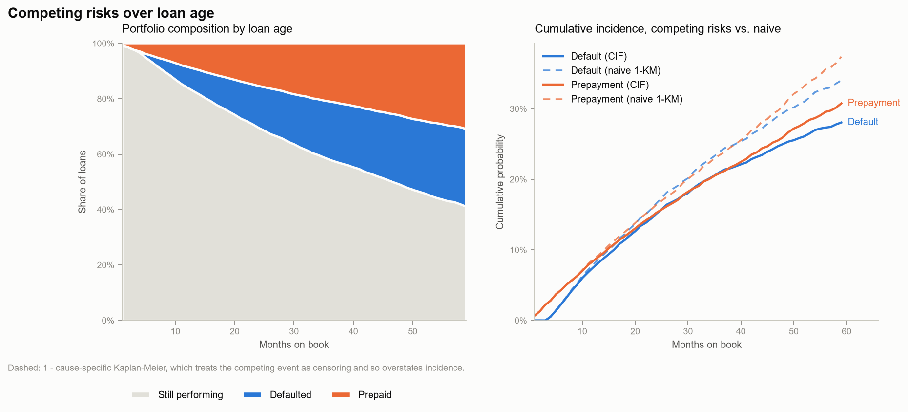
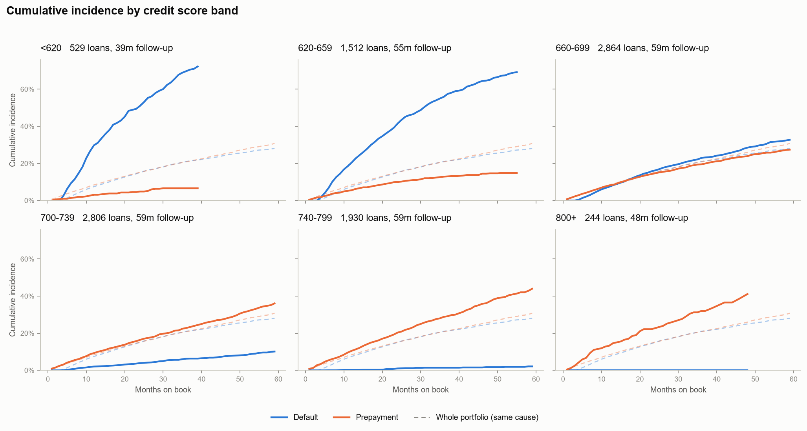
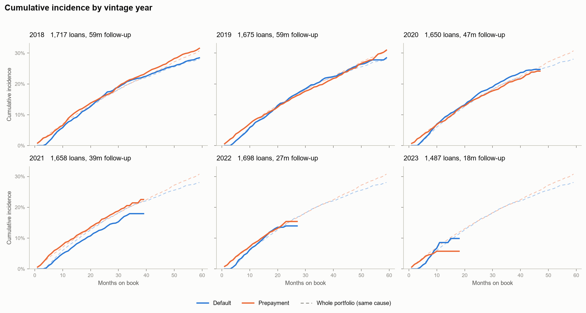
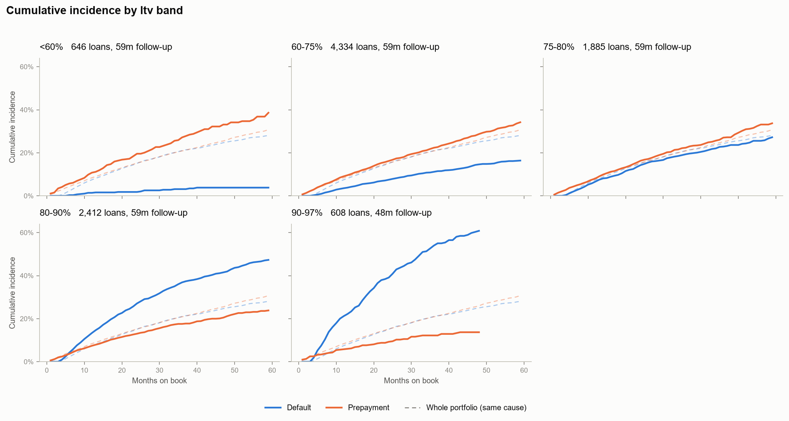
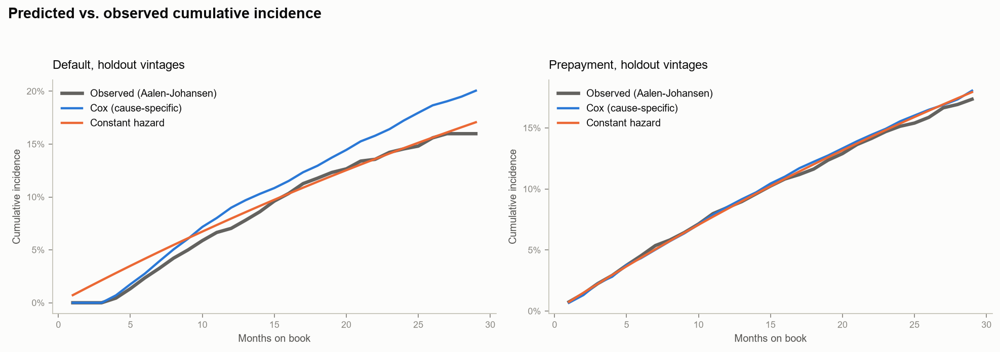
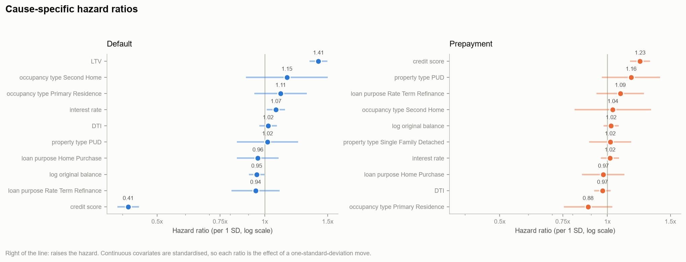
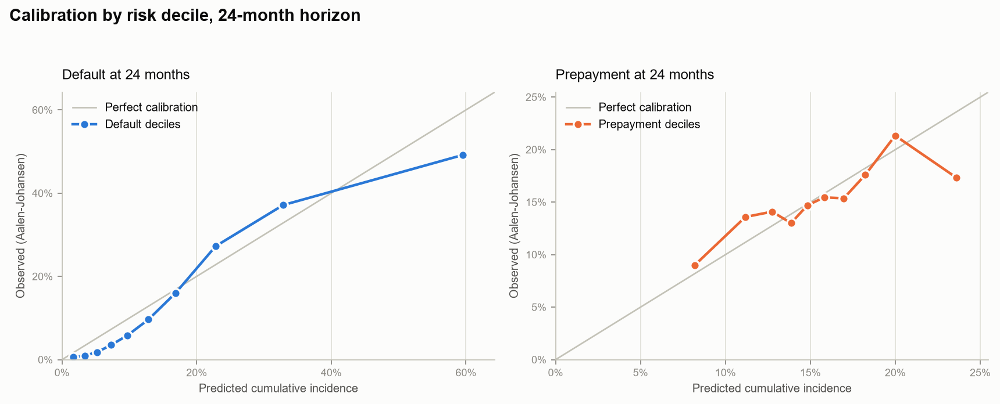

# Survival & Competing-Risk Report (Task 3)

_Generated 2026-08-30 14:35:58_

## What this models

Time to **default** and time to **prepayment**, as competing risks, on a clock measured in **months on book** rather than calendar months. Two loans originated four years apart are compared at the same age, which is what stops a young vintage from looking safe merely because it has not had time to fail yet.

Models are fitted on vintages originated up to **2021-06** (5,896 loans) and evaluated on later vintages (3,989 loans) that the model has never seen. Splitting on origination rather than reporting month keeps each loan's history intact -- a duration model cannot represent half a loan -- while still guaranteeing the holdout is strictly forward in time.

## Outcomes

Every loan ends in exactly one of these states at the observation cutoff.

| outcome   |   loans |    share |
|:----------|--------:|---------:|
| censored  |    6072 | 0.614264 |
| prepaid   |    1965 | 0.198786 |
| default   |    1848 | 0.18695  |

## Censoring and data-quality bookkeeping

Every count the transformation from panel to duration data produced.

| metric                            | value              |
|:----------------------------------|:-------------------|
| loans                             | 9885               |
| observation_cutoff                | 2023-12            |
| events_default                    | 1848               |
| events_prepaid                    | 1965               |
| censored_total                    | 6072               |
| censored_administrative           | 5348               |
| censored_lost_to_followup         | 724                |
| left_truncated_loans              | 0                  |
| left_truncation_enabled           | True               |
| calendar_vs_age_order_anomalies   | 1528               |
| zombie_rows_dropped               | 1319               |
| zombie_loans_affected             | 664                |
| degenerate_events_given_one_month | 0                  |
| degenerate_censored_dropped       | 115                |
| total_exposure_months             | 260064.0           |
| median_follow_up_months           | 23.0               |
| censoring_rate                    | 0.6142640364188164 |

## How censoring was treated

A survival model is defined by what it does with the loans that *did not* have
an event. This pipeline treats them in four distinct ways, and the counts
behind each are in the censoring table above.

**1. Right-censoring at the observation cutoff (administrative).**
Most loans in the book are still performing when the panel ends. They are not
"no default" observations -- they are "no default *yet*", and the difference is
the whole subject. Each contributes its full exposure (`exit_month - entry_month`)
to every risk set it survives through, and contributes no event. Dropping them
would be catastrophic: only resolved loans would remain, and 1,848 of the 3,813
resolved loans defaulted, so the "default rate" would read 48% against the
36-month Aalen-Johansen estimate of 21%. Administrative censoring is non-informative by construction -- the
cutoff date has nothing to do with any individual loan's risk -- which is the
condition Kaplan-Meier, Aalen-Johansen and Cox all require.

**2. Right-censoring before the cutoff (loss to follow-up).**
A smaller group stops being reported before the cutoff. These are handled
identically in the arithmetic, but counted separately in the report, because
they are the ones that could break the non-informative assumption: if loans
disappear from the feed *because* they are deteriorating, every estimate here
is optimistic. The rate is reported so a reviewer can judge that risk rather
than take it on trust.

**3. Prepayment as a competing risk, not as censoring.**
A prepaid loan has left the portfolio and can never default. Treating it as
censored asserts that it might still default at some unobserved future time,
which inflates default incidence -- on this pack, `1 - KM` puts 36-month default
at 23.9% against the Aalen-Johansen estimate of 21.0%, a 2.9pp overstatement
from that assumption alone. Cause-specific hazards are estimated with the
competing event censored (correct for a *hazard*), and cumulative incidence is
then rebuilt with the Aalen-Johansen weighting (correct for a *probability*).
Both are reported side by side.

**4. Left truncation (delayed entry).**
A loan first observed at month 10 is only in the sample because it survived to
month 10; counting it in the risk set from month 0 would understate early
hazards. Every estimator here takes an `entry` argument and builds its risk set
as `{entry < t <= exit}`. On this pack no loan is genuinely truncated -- every
loan has a month-0 row -- but 1,528 loans have a *calendar*-first row at a later
age because their month-0 row carries a corrupted `reporting_month` (the Phase 1
"Time Travel" defect). Reading entry off calendar order would manufacture
1,528 left-truncated loans out of a data defect, so durations are taken on the
loan-age axis throughout and the disagreement between the two orderings is
counted rather than absorbed.

**A fifth case that is not censoring at all: zombie rows.**
`Default` and `Prepaid` are absorbing states. Where an active row appears after
one, it is the Phase 1 "Zombie Loan" defect, not a recovery. The outcome is
therefore read from the *earliest absorbing row by loan age* and later rows are
discarded. Reading the last row instead -- the obvious `groupby().last()` --
reclassifies 664 resolved loans in this pack as still active, which would move
them from the event count into the censored count and bias every curve downward.

## Baseline: constant hazard

Occurrence over exposure -- one monthly hazard per cause, no covariates. Censored loans contribute exposure to the denominator, which is why they cannot be dropped.

| cause   |   events |   exposure_months |   monthly_hazard |   annualised_rate |
|:--------|---------:|------------------:|-----------------:|------------------:|
| default |     1482 |            204599 |       0.00724344 |         0.0835407 |
| prepaid |     1557 |            204599 |       0.00761001 |         0.0875932 |

## Cumulative incidence at fixed horizons

Aalen-Johansen competing-risk estimates, with the naive `1 - KM` alongside. The gap between the two columns is the cost of treating the competing event as censoring.

| cause   |   months_on_book |   cif_aalen_johansen |   naive_1_minus_km |   overstatement_pp |
|:--------|-----------------:|---------------------:|-------------------:|-------------------:|
| default |               12 |            0.0747768 |          0.0788233 |           0.40465  |
| default |               24 |            0.15121   |          0.165966  |           1.47559  |
| default |               36 |            0.210194  |          0.239432  |           2.92384  |
| default |               48 |            0.250164  |          0.294193  |           4.40288  |
| prepaid |               12 |            0.083944  |          0.086161  |           0.221696 |
| prepaid |               24 |            0.152579  |          0.164099  |           1.152    |
| prepaid |               36 |            0.208834  |          0.234561  |           2.57267  |
| prepaid |               48 |            0.259774  |          0.303826  |           4.40522  |

## Model comparison (holdout vintages)

Concordance is Harrell's C on the holdout; Brier scores are IPCW-weighted, with the censoring distribution estimated on train. The constant-hazard model scores C = 0.5 by construction -- it has no covariates -- so the comparison that matters for it is the Brier column.

| cause   | model           |   concordance |   integrated_brier |   brier_12m |   brier_24m |   brier_36m |
|:--------|:----------------|--------------:|-------------------:|------------:|------------:|------------:|
| default | constant_hazard |      0.5      |          0.0645763 |   0.0527666 |   0.0728258 |   0.059887  |
| default | kaplan_meier    |      0.5      |          0.084517  |   0.0569623 |   0.0933802 |   0.0943454 |
| default | cox             |      0.822436 |          0.0440103 |   0.0465355 |   0.0490936 |   0.0313185 |
| prepaid | constant_hazard |      0.5      |          0.0706927 |   0.0647126 |   0.0773332 |   0.0633919 |
| prepaid | kaplan_meier    |      0.5      |          0.094694  |   0.0714519 |   0.101689  |   0.103947  |
| prepaid | cox             |      0.558084 |          0.0702642 |   0.0643381 |   0.0767043 |   0.06331   |

## Cause-specific hazard ratios

Per one standard deviation for continuous covariates. Above 1 raises the hazard.

| cause   | covariate                            |   hazard_ratio |   hr_lower_95 |   hr_upper_95 |          z |      p_value |
|:--------|:-------------------------------------|---------------:|--------------:|--------------:|-----------:|-------------:|
| default | ltv                                  |       1.4124   |      1.33332  |      1.49616  |  11.7463   | 7.37683e-32  |
| default | occupancy_type_Second_Home           |       1.15279  |      0.886252 |      1.49949  |   1.05986  | 0.289209     |
| default | occupancy_type_Primary_Residence     |       1.10691  |      0.934577 |      1.31103  |   1.17637  | 0.239447     |
| default | interest_rate                        |       1.07457  |      1.01408  |      1.13866  |   2.43305  | 0.0149722    |
| default | dti                                  |       1.02123  |      0.965179 |      1.08053  |   0.729342 | 0.465793     |
| default | property_type_PUD                    |       1.0173   |      0.835569 |      1.23855  |   0.170798 | 0.864383     |
| default | property_type_Single_Family_Detached |       1.01084  |      0.880467 |      1.16051  |   0.152977 | 0.878416     |
| default | original_term_months                 |       1.0073   |      0.958257 |      1.05885  |   0.28551  | 0.775253     |
| default | loan_purpose_Home_Purchase           |       0.956403 |      0.836283 |      1.09378  |  -0.650958 | 0.515073     |
| default | log_original_balance                 |       0.949045 |      0.902563 |      0.997921 |  -2.04118  | 0.0412328    |
| default | loan_purpose_Rate_Term_Refinance     |       0.942341 |      0.806425 |      1.10116  |  -0.74731  | 0.454876     |
| default | credit_score                         |       0.414765 |      0.386981 |      0.444544 | -24.8768   | 1.32638e-136 |
| prepaid | credit_score                         |       1.23364  |      1.15735  |      1.31495  |   6.44695  | 1.14121e-10  |
| prepaid | property_type_PUD                    |       1.16453  |      0.965366 |      1.40479  |   1.59164  | 0.111464     |
| prepaid | loan_purpose_Rate_Term_Refinance     |       1.08609  |      0.932267 |      1.2653   |   1.05986  | 0.289208     |
| prepaid | occupancy_type_Second_Home           |       1.03518  |      0.809873 |      1.32317  |   0.276089 | 0.78248      |
| prepaid | log_original_balance                 |       1.02349  |      0.974639 |      1.07478  |   0.930427 | 0.35215      |
| prepaid | property_type_Single_Family_Detached |       1.01779  |      0.889497 |      1.16459  |   0.256551 | 0.797526     |
| prepaid | interest_rate                        |       1.01658  |      0.959223 |      1.07736  |   0.554878 | 0.578978     |
| prepaid | ltv                                  |       1.00553  |      0.951813 |      1.06228  |   0.196877 | 0.843923     |
| prepaid | original_term_months                 |       0.986611 |      0.939762 |      1.0358   |  -0.543042 | 0.587101     |
| prepaid | loan_purpose_Home_Purchase           |       0.974394 |      0.850133 |      1.11682  |  -0.372679 | 0.709388     |
| prepaid | dti                                  |       0.968381 |      0.917459 |      1.02213  |  -1.1658   | 0.243697     |
| prepaid | occupancy_type_Primary_Residence     |       0.882906 |      0.755923 |      1.03122  |  -1.57192  | 0.11597      |

## Proportional-hazards diagnostics

Schoenfeld residual test. A small p-value means that covariate's hazard ratio is not constant over loan age -- reported rather than corrected, because it is the assumption the Cox model rests on and it belongs in the model card.

| cause   | error                                  |
|:--------|:---------------------------------------|
| default | Residuals for entries not implemented. |
| prepaid | Residuals for entries not implemented. |

## Calibration by risk decile

Predicted cumulative incidence against the Aalen-Johansen estimate computed inside each decile, so censoring is respected on both sides of the comparison.

| cause   |   horizon_months |   decile |   loans |   mean_predicted |   observed_cif |         gap |
|:--------|-----------------:|---------:|--------:|-----------------:|---------------:|------------:|
| default |               24 |        1 |     399 |        0.01695   |     0.00593163 |  0.0110184  |
| default |               24 |        2 |     399 |        0.0343224 |     0.00988409 |  0.0244383  |
| default |               24 |        3 |     399 |        0.0522807 |     0.018091   |  0.0341897  |
| default |               24 |        4 |     399 |        0.0730693 |     0.0353938  |  0.0376755  |
| default |               24 |        5 |     399 |        0.0974495 |     0.0585393  |  0.0389102  |
| default |               24 |        6 |     398 |        0.128452  |     0.0965706  |  0.0318809  |
| default |               24 |        7 |     399 |        0.16883   |     0.160366   |  0.00846407 |
| default |               24 |        8 |     399 |        0.228244  |     0.272655   | -0.0444106  |
| default |               24 |        9 |     399 |        0.328507  |     0.371439   | -0.0429322  |
| default |               24 |       10 |     399 |        0.595273  |     0.491718   |  0.103554   |
| prepaid |               24 |        1 |     399 |        0.081852  |     0.0899043  | -0.00805226 |
| prepaid |               24 |        2 |     399 |        0.111733  |     0.135875   | -0.0241422  |
| prepaid |               24 |        3 |     399 |        0.127499  |     0.140947   | -0.0134483  |
| prepaid |               24 |        4 |     399 |        0.138639  |     0.130061   |  0.00857845 |
| prepaid |               24 |        5 |     399 |        0.148241  |     0.146977   |  0.00126362 |
| prepaid |               24 |        6 |     398 |        0.158115  |     0.154546   |  0.00356883 |
| prepaid |               24 |        7 |     399 |        0.169647  |     0.153654   |  0.0159937  |
| prepaid |               24 |        8 |     399 |        0.182391  |     0.176108   |  0.00628252 |
| prepaid |               24 |        9 |     399 |        0.199923  |     0.213357   | -0.0134339  |
| prepaid |               24 |       10 |     399 |        0.235943  |     0.173375   |  0.062568   |

## Event curves

**Competing risks over loan age**

**Cumulative incidence by credit score band**

**Cumulative incidence by vintage year**

**Cumulative incidence by ltv band**

**Predicted vs observed on the holdout**

**Cause-specific hazard ratios**

**Calibration by risk decile**

